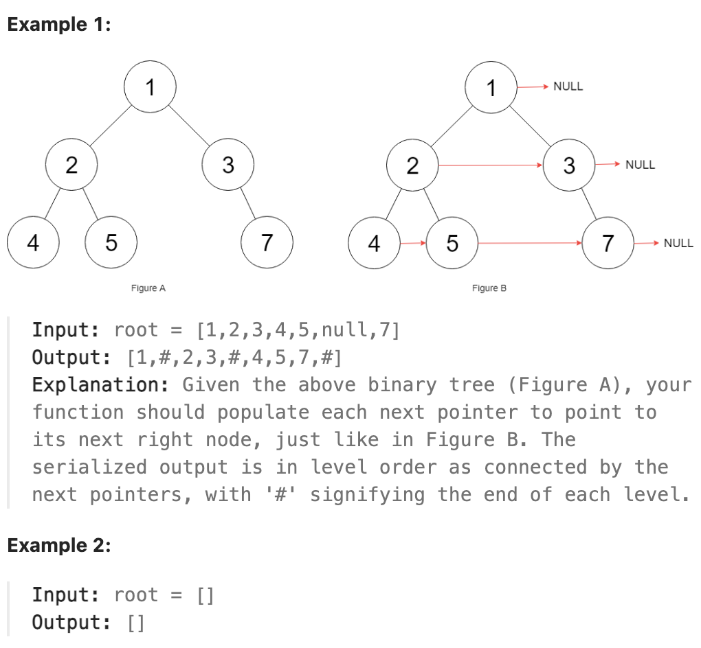

# 117.Populating Next Right Pointers in Each Node II

## LeetCode 题目链接

[117.填充每个节点的下一个右侧节点指针 II](https://leetcode.cn/problems/populating-next-right-pointers-in-each-node-ii/)

## 题目大意

给定一个二叉树：

```js
struct Node {
  int val;
  Node *left;
  Node *right;
  Node *next;
}
```

填充它的每个 `next` 指针，让这个指针指向其下一个右侧节点。如果找不到下一个右侧节点，则将 `next` 指针设置为 `NULL` 

初始状态下，所有 `next` 指针都被设置为 `NULL` 



限制:
- The number of nodes in the tree is in the range [0, 6000].
- -100 <= Node.val <= 100

## 解题

### 思路 1: 层次遍历

```js
var connect = function(root) {
    if (root === null) return null;
    let que = [];
    que.push(root);

    while (que.length > 0) {
        let size = que.length;
        // 遍历一层
        let pre = null;
        for (let i = 0; i < size; i++) {
            let cur = que.shift();
            // 链接当前层所有节点的 next 指针
            if (pre !== null) pre.next = cur;
            pre = cur;
            // 将下一层节点装入队列
            if (cur.left !== null) que.push(cur.left);
            if (cur.right !== null) que.push(cur.right);
        }
    }
    return root;
};
```
```python
class Solution:
    def connect(self, root: 'Node') -> 'Node':
        if root is None:
            return None
        # 二叉树层序遍历框架
        que = deque([root])
        while que:
            size = len(que)
            # 遍历一层
            pre = None
            for i in range(size):
                cur = que.popleft()
                # 链接当前层所有节点的 next 指针
                if pre is not None:
                    pre.next = cur
                pre = cur

                # 将下一层节点装入队列
                if cur.left is not None:
                    que.append(cur.left)
                if cur.right is not None:
                    que.append(cur.right)
                    
        return root
```

- 时间复杂度：`O(n)`，树上的点的个数为 `n`，需遍历这棵树上所有的点，时间复杂度为 `O(n)`
- 空间复杂度：`O(n)`，即队列的空间代价

### 思路 2: 使用已建立的 next 指针

因为必须处理树上的所有节点，所以无法降低时间复杂度，但可以尝试降低空间复杂度

一旦在某层的节点之间建立了 `next` 指针，那这层节点实际上形成了一个链表 -> 如果先去建立某一层的 `next` 指针，再去遍历这一层，就无需再使用队列了

具体来说：
- 从根节点开始，第 `0` 层只有一个节点，不需要处理。可以在上一层为下一层建立 `next` 指针。该方法最重要的一点是：位于第 `i` 层时为第 `i+1` 层建立 `next` 指针。一旦完成这些连接操作，移至第 `i+1` 层为第 `i+2` 层建立 `next` 指针
- 当遍历到某层节点时，该层节点的 `next` 指针已经建立，这样就不需队列从而节省空间。每次只要知道下一层的最左边的节点，就可从该节点开始，像遍历链表一样遍历该层的所有节点

```js
var connect = function(root) {
    if (root === null) return null;
    let start = root;

    let last = null, nextStart = null;
    const handle = (p) => {
        if (last !== null) last.next = p;
        if (nextStart === null)  nextStart = p;
        last = p;
    };
    while (start != null) {
        last = null;
        nextStart = null;
        for (let p = start; p !== null; p = p.next) {
            if (p.left !== null) handle(p.left);
            if (p.right !== null) handle(p.right);
        }
        start = nextStart;
    }

    return root;
};
```
```python
class Solution:
    def connect(self, root: 'Node') -> 'Node':
        if not root:
            return None
        start = root
        while start:
            # 用 last 记录当前层 连接的最后一个节点
            self.last = None
            # 用 nextStart 记录 下一层的第一个节点
            self.nextStart = None
            p = start
            # 遍历当前层，每个 p 节点
            while p:
                if p.left:
                    self.handle(p.left)

                if p.right:
                    self.handle(p.right)

                p = p.next
                
            start = self.nextStart
        return root
    
    def handle(self, p):
        # 如果 last 存在，last.next = p（建立连接）
        if self.last:
            self.last.next = p

        # 如果 nextStart 还未设置，则 nextStart = p（记录下一层第一个节点）
        if not self.nextStart:
            self.nextStart = p

        # 更新 last = p
        self.last = p
```

- 时间复杂度：`O(n)`，树上的点的个数为 `n`，需要遍历这棵树上所有的点，时间复杂度为 `O(n)`
- 空间复杂度：`O(1)`


