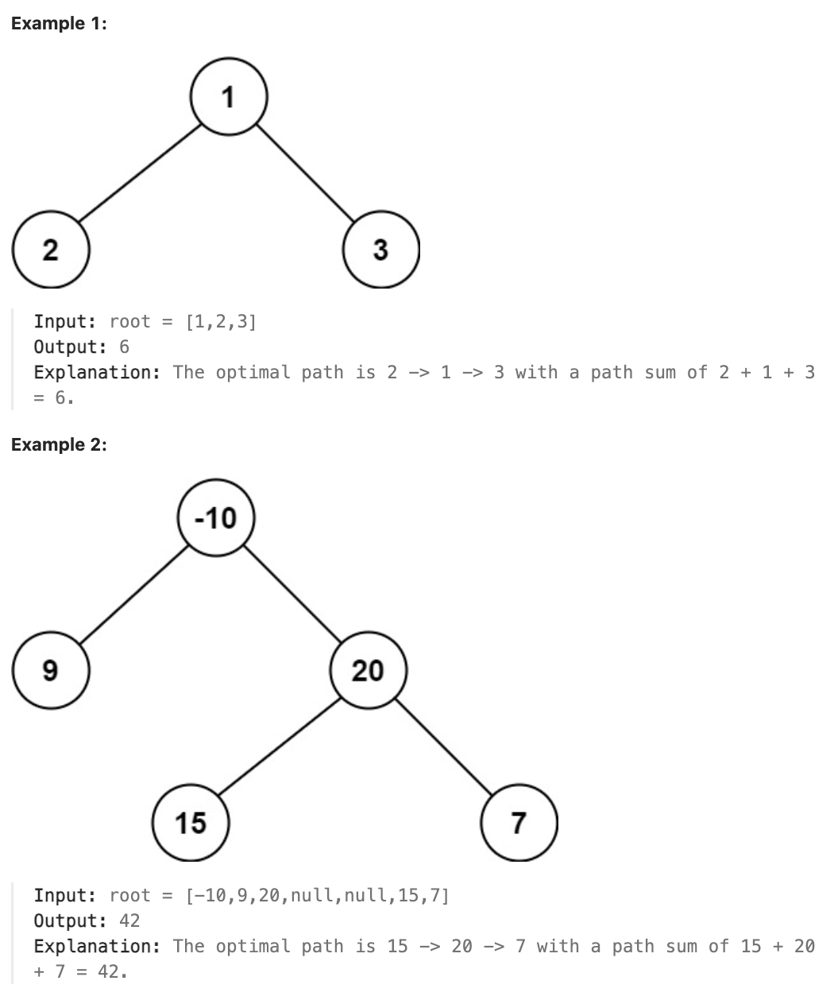

# 124.Binary Tree Maximum Path Sum

## LeetCode 题目链接

[124.二叉树中的最大路径和](https://leetcode.cn/problems/binary-tree-maximum-path-sum/)

## 题目大意

二叉树中的路径被定义为一条节点序列，序列中每对相邻节点之间都存在一条边。同一个节点在一条路径序列中至多出现一次，该路径至少包含一个节点，且不一定经过根节点

路径和是路径中各节点值的总和

给你一个二叉树的根节点 `root`，返回其最大路径和 



限制：
- The number of nodes in the tree is in the range [1, 3 * 10^4].
- -1000 <= Node.val <= 1000
  
## 解题

可以用`DFS`来解决此问题。在每个节点上，会计算两部分：
- 通过当前节点的左子树能得到的最大路径和
- 通过当前节点的右子树能得到的最大路径和
  
对于每个节点，计算以下两个值：
- 单边路径和：当前节点的值加上左子树路径和或右子树路径和的较大者，表示单边路径（只能选择左子树或右子树之一）
- 全路径和：左子树路径和 + 当前节点的值 + 右子树路径和，表示从左子树经过当前节点再到右子树的路径和
  
在遍历每个节点的过程中，维护一个全局变量记录最大路径和

```js
var maxPathSum = function(root) {
    let maxSum = -Infinity;
    const dfs = function(node) {
        if (!node) return 0;
        // 计算左右子树的单边最大路径和
        const leftSum = Math.max(dfs(node.left), 0);
        const rightSum = Math.max(dfs(node.right), 0);
        // 计算通过当前节点的最大路径和
        const priceNewPath = node.val + leftSum + rightSum;
        // 更新最大路径和
        maxSum = Math.max(maxSum, priceNewPath);
        // 返回单边路径和给父节点使用
        return node.val + Math.max(leftSum, rightSum);
    };
    dfs(root);
    return maxSum;
};
```
```python
class Solution:
    def maxPathSum(self, root: Optional[TreeNode]) -> int:
        # 初始值为负无穷大，因为路径和可能包含负数值节点，确保能够找到最大值
        self.max_sum = float('-inf')

        def dfs(node):
            # 如果当前节点为空（即叶子节点的子节点），返回 0，表示该分支的路径和为零
            if not node:
                return 0
            
            # 计算左右子树的单边最大路径和
            # 使用 max(..., 0) 来忽略负数路径和。如果左子树或右子树的路径和为负数，将其视为 0，即不计入当前路径。这是因为负路径和会降低整体路径和
            left_sum = max(dfs(node.left), 0)
            right_sum = max(dfs(node.right), 0)

            # 计算通过当前节点的最大路径和
            # 这是一个完整路径，意味着可以选择左子树、右子树和当前节点一起形成一条路径
            price_newpath = node.val + left_sum + right_sum

            # 更新最大路径和
            self.max_sum = max(self.max_sum, price_newpath)

            # 返回单边路径和给父节点使用
            # 对于父节点而言，只能选择一条子树路径（左子树或右子树），而不能同时选择两条路径（因为路径不能分叉）
            return node.val + max(left_sum, right_sum)

        dfs(root)
        return self.max_sum
```

- 时间复杂度：`O(n)`，其中 `n` 是节点数。每个节点都被访问一次，因此时间复杂度是线性的
- 空间复杂度：`O(h)`，其中 `h` 是二叉树的高度。递归栈的最大深度等于树的高度
  - 在最坏情况下（如链式树），空间复杂度为 `O(n)`
  - 在平均情况下（平衡树），空间复杂度为 `O(logn)`