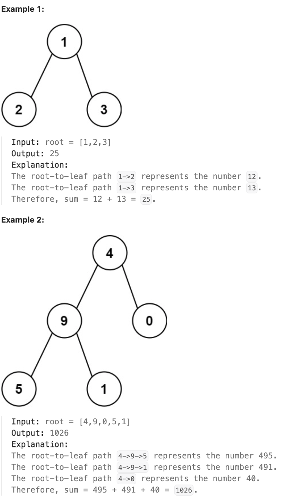

# 129.Sum Root to Leaf Numbers 

## LeetCode 题目链接

[129.求根节点到叶节点数字之和](https://leetcode.cn/problems/sum-root-to-leaf-numbers/)

## 题目大意

给你一个二叉树的根节点 `root`，树中每个节点都存放有一个 `0` 到 `9` 之间的数字

每条从根节点到叶节点的路径都代表一个数字：
- 例如，从根节点到叶节点的路径 `1 -> 2 -> 3` 表示数字 `123` 
  
计算从根节点到叶节点生成的所有数字之和 

叶节点是指没有子节点的节点



限制：
- The number of nodes in the tree is in the range [1, 1000].
- 0 <= Node.val <= 9
- The depth of the tree will not exceed 10.
  
## 解题

### 思路 1: DFS

```js
// 写法 1
var sumNumbers = function(root) {
    let path = [];
    let res = 0;

    const traverse = function(root) {
        if (root === null) return;

        path.push(root.val);
        if (root.left === null && root.right === null) {
            res += parseInt(path.join(''));
        }

        traverse(root.left);
        traverse(root.right);

        path.pop();
    };

    traverse(root);
    return res;
};

// 写法 2
var sumNumbers = function(root) {
    return dfs(root, 0);
};

const dfs = (root, prevSum) => {
    if (root === null) return 0;
    
    const sum = prevSum * 10 + root.val;
    if (root.left == null && root.right == null) {
        return sum;
    } else {
        return dfs(root.left, sum) + dfs(root.right, sum);
    }
}
```
```python
# 写法 1
class Solution:
    def __init__(self):
        self.path = ""
        self.res = 0

    def sumNumbers(self, root: Optional[TreeNode]) -> int:
        self.traverse(root)
        return self.res
    
    def traverse(self, root):
        if root is None:
            return
        
        self.path += str(root.val)
        if root.left is None and root.right is None:
            self.res += int(self.path)
        
        self.traverse(root.left)
        self.traverse(root.right)

        self.path = self.path[:-1]

# 写法 2
class Solution:
   
    def sumNumbers(self, root: Optional[TreeNode]) -> int:
        def dfs(root: TreeNode, prevTotal: int) -> int:
            if not root:
                return 0
            
            total = prevTotal * 10 + root.val
            if not root.left and not root.right:
                return total
            else:
                return dfs(root.left, total) + dfs(root.right, total)
        
        return dfs(root, 0)
```

- 时间复杂度：`O(n)`，其中 `n` 是二叉树的节点个数，对每个节点访问一次
- 空间复杂度：`O(n)`，其中 `n` 是二叉树的节点个数，空间复杂度主要取决于递归调用的栈空间，递归栈的深度等于二叉树的高度，最坏情况下，二叉树的高度等于节点个数，空间复杂度为 `O(n)`

### 思路 2: BFS

```js
var sumNumbers = function(root) {
    if (root === null) return 0;
    let sum = 0;
    const nodeQue = [], numQue = [];
    nodeQue.push(root);
    numQue.push(root.val);

    while (nodeQue.length) {
        const node = nodeQue.shift();
        const num = numQue.shift();
        const left = node.left, right = node.right;

        if (left === null && right === null) {
            sum += num;
        } else {
            if (left !== null) {
                nodeQue.push(left);
                numQue.push(num * 10 + left.val);
            }
            if (right !== null) {
                nodeQue.push(right);
                numQue.push(num * 10 + right.val);
            }
        }
    }

    return sum;
};
```
```python
class Solution:
    def sumNumbers(self, root: Optional[TreeNode]) -> int:
        if not root:
            return 0
        
        total = 0
        nodeQue = collections.deque([root])
        numQue = collections.deque([root.val])

        while nodeQue:
            node = nodeQue.popleft()
            num = numQue.popleft()
            left, right = node.left, node.right
            if not left and not right:
                total += num
            else:
                if left:
                    nodeQue.append(left)
                    numQue.append(num * 10 + left.val)
                if right:
                    nodeQue.append(right)
                    numQue.append(num * 10 + right.val)

        return total
```

- 时间复杂度：`O(n)`，其中 `n` 是二叉树的节点个数，对每个节点访问一次。
- 空间复杂度：`O(n)`，其中 `n` 是二叉树的节点个数，空间复杂度主要取决于队列，每个队列中的元素个数不会超过 `n`
