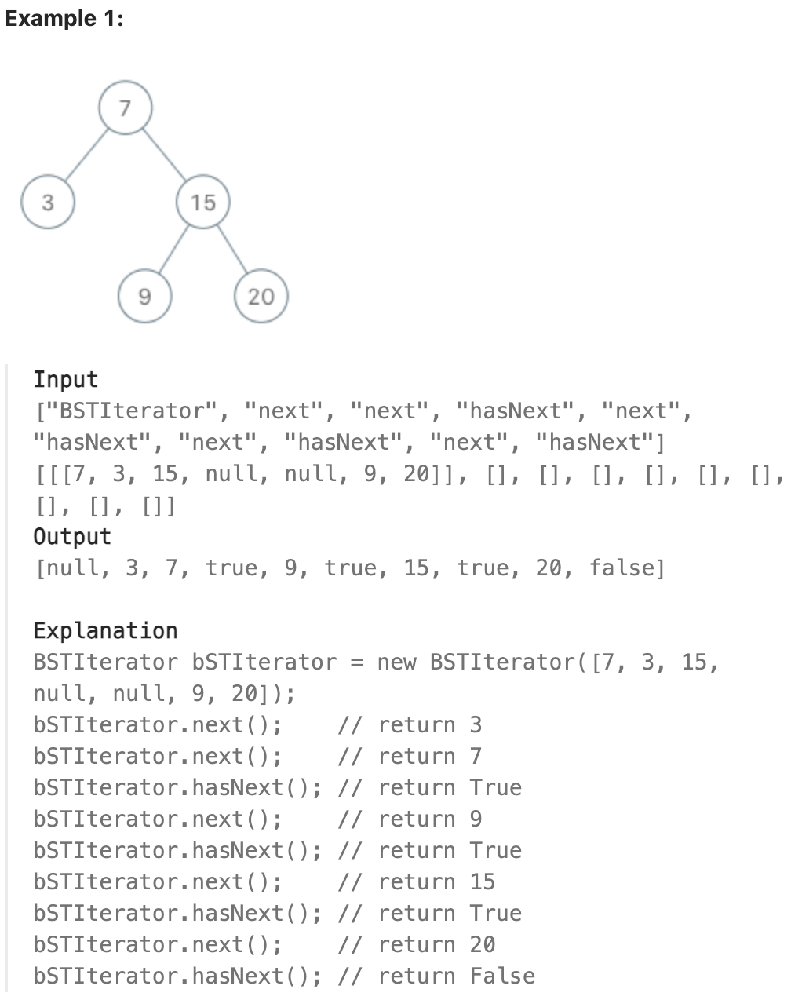

# 173.Binary Search Tree Iterator

## LeetCode 链接

[173.二叉搜索树迭代器](https://leetcode.cn/problems/binary-search-tree-iterator/)

## 题目大意

实现一个二叉搜索树迭代器类 `BSTIterator`，表示一个按中序遍历二叉搜索树（`BST`）的迭代器：
- `BSTIterator(TreeNode root)` 初始化 `BSTIterator` 类的一个对象。`BST` 的根节点 `root` 会作为构造函数的一部分给出。指针应初始化为一个不存在于 `BST` 中的数字，且该数字小于 `BST` 中的任何元素
- `boolean hasNext()` 如果向指针右侧遍历存在数字，则返回 `true`；否则返回 `false` 
- `int next()` 将指针向右移动，然后返回指针处的数字
  
注意，指针初始化为一个不存在于 `BST` 中的数字，所以对 `next()` 的首次调用将返回 `BST` 中的最小元素

可以假设 `next() `调用总是有效的，也就是说，当调用 `next()` 时，`BST` 的中序遍历中至少存在一个下一个数字



限制：
- The number of nodes in the tree is in the range [1, 10^5].
- 0 <= Node.val <= 10^6
- At most 10^5 calls will be made to hasNext, and next.

## 解题

### 思路 1: 递归

可以直接对二叉搜索树做一次完全的递归遍历，获取中序遍历的全部结果并保存在数组中。随后，利用得到的数组本身来实现迭代器

```python
class BSTIterator:

    def __init__(self, root: Optional[TreeNode]):
        self.index = 0
        self.arr = []
        self.inorderTraversal(root, self.arr)

    def next(self) -> int:
        val = self.arr[self.index]
        self.index += 1
        return val

    def hasNext(self) -> bool:
        return self.index < len(self.arr)
    
    def inorderTraversal(self, root, arr):
        if not root:
            return
        
        self.inorderTraversal(root.left, arr)
        arr.append(root.val)
        self.inorderTraversal(root.right, arr)
```

- 时间复杂度：初始化需要 `O(n)` 的时间，其中 `n` 为树中节点的数量，随后每次调用只需要 `O(1)` 的时间
- 空间复杂度：`O(n)`，因为需要保存中序遍历的全部结果

### 思路 2: 迭代

```js
var BSTIterator = function(root) {
    this.cur = root;
    this.stack = [];
};

BSTIterator.prototype.next = function() {
    while (this.cur) {
        this.stack.push(this.cur);
        this.cur = this.cur.left;
    }

    this.cur = this.stack.pop();
    const res = this.cur.val;
    this.cur = this.cur.right;
    return res;
};

BSTIterator.prototype.hasNext = function() {
    return this.cur !== null || this.stack.length;
};
```
```python
class BSTIterator:

    def __init__(self, root: Optional[TreeNode]):
        self.cur = root
        self.stack = []

    # next() 方法返回 二叉搜索树 (BST) 的下一个最小值
    def next(self) -> int:
        while self.cur:
            self.stack.append(self.cur)
            self.cur = self.cur.left  # 先遍历左子树
        
        self.cur = self.stack.pop()
        ret = self.cur.val  # 记录当前节点值
        self.cur = self.cur.right  # 移动到右子树
        return ret
    
    # hasNext() 方法返回 是否还有下一个最小值
    def hasNext(self) -> bool:
        return self.cur is not None or bool(self.stack)
```

- 时间复杂度：
  - 初始化和调用 `hasNext()` 都只需要 `O(1)` 的时间
  - 每次调用 `next()` 函数最坏情况下需要 `O(n)` 的时间；但考虑到 `n` 次调用 `next()` 函数总共会遍历全部的 `n` 个节点，因此总的时间复杂度为 `O(n)`，因此单次调用平均下来的均摊复杂度为 `O(1)`
- 空间复杂度：`O(n)`，其中 `n` 是二叉树的节点数量。空间复杂度取决于栈深度，而栈深度在二叉树为一条链的情况下会达到 `O(n)` 的级别


