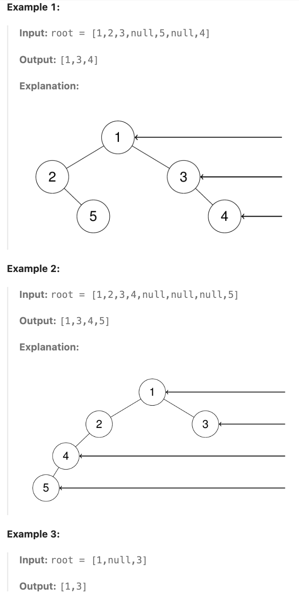

# 199.Binary Tree Right Side View

## LeetCode 题目链接

[199.二叉树的右视图](https://leetcode.cn/problems/binary-tree-right-side-view/)

## 题目大意

给定一个二叉树的根节点 `root`，想象自己站在它的右侧，按照从顶部到底部的顺序，返回从右侧所能看到的节点值



限制:
- The number of nodes in the tree is in the range [0, 100].
- -100 <= Node.val <= 100

## 解题

### 思路 1: DFS

用 `DFS` 递归遍历算法，需反过来，先递归 `root.right` 再递归 `root.left`，同时用 `res` 记录每一层的最右侧节点作为右侧视图

```js
var rightSideView = function(root) {
    let res = [];
    const traverse = function(root, depth) {
        if (root == null) return;
        if (res.length == depth) res.push(root.val);
        traverse(root.right, depth+1);
        traverse(root.left, depth+1);
    };

    traverse(root, 0);
    return res;
};
```
```python
class Solution:
    def rightSideView(self, root: Optional[TreeNode]) -> List[int]:
        self.res = []
        # 从根节点开始递归遍历，初始深度为 0
        self.traverse(root, 0)
        return self.res
    
    def traverse(self, root, depth):
        # 如果当前节点为 None，说明已经到达叶子节点的下一层，直接返回，不做任何处理
        if not root:
            return
        
        # len(self.res) 表示 self.res 中已经存储的节点数量，即已包含了的深度（层级）
        # 如果 len(self.res) == depth，表示当前深度还没有被添加到 self.res 中，说明当前节点是该层的第一个被访问到的节点（即右视图中能够看到的节点）
        if len(self.res) == depth:
            self.res.append(root.val)
        
        # 这样做是为了确保优先遍历右子树，从而在每层中最先被添加到 self.res 的节点都是右视图中看到的节点
        self.traverse(root.right, depth + 1)
        self.traverse(root.left, depth + 1)
```

- 时间复杂度：`O(n)`，每个节点在遍历时都被访问一次，其中 `n` 是树中节点的数量
- 空间复杂度：`O(h)`
  - 递归调用栈的最大深度取决于二叉树的高度 `h`
  - 最坏情况下（即树是链状结构），递归深度为 `n`，即 `O(n)`
  - 最佳情况下（即树是平衡二叉树），递归深度为 `O(logn)`

### 思路 2: BFS

层序遍历时，判断是否遍历到了单层的最后面的元素，若是就放进 `res` 数组中，随后返回 `res` 即可

```js
var rightSideView = function(root) {
    let res = [];
    if (root == null) return res;
    let que = [];
    que.push(root);
    while (que.length > 0) {
        let levelSize = que.length;
        let last = que[0];
        for (let i = 0; i < levelSize; i++) {
            let cur = que.shift();
            if (cur.right != null) que.push(cur.right);
            if (cur.left != null) que.push(cur.left);
        }

        res.push(last.val);
    }
    return res;
};
```
```python
class Solution:
    def rightSideView(self, root: Optional[TreeNode]) -> List[int]:
        res = []
        if not root:
            return res
        
        que = collections.deque([root])
        while que:
            levelSize = len(que)
            # 每一层头部就是最右侧的元素
            last = que[0]
            for i in range(levelSize):
                cur = que.popleft()
                if cur.right:
                    que.append(cur.right)
                if cur.left:
                    que.append(cur.left)
            
            res.append(last.val)
        
        return res
```

- 时间复杂度：`O(n)`
  - 在 `while` 循环中，`BFS` 逐层遍历每个节点，每个节点仅被访问一次，假设二叉树有 `n` 个节点，遍历这些节点的时间复杂度为 `O(n)`
  - 每次遍历层级时，队列长度即为当前层的节点数。对于每个节点，将其左右子节点（若存在）加入队列，这些操作也是 `O(1)`
- 空间复杂度：`O(n)`
  - 队列在最坏情况下会存储最多一层的节点数，在一棵完全二叉树中，最底层的节点数接近于总节点数的一半，所以队列的空间复杂度是 `O(n)`
  - `res` 最多存储每层的一个节点值，因此对于高度为 `h` 的树，结果列表的空间复杂度为 `O(h)`，而在最坏情况下（如完全不平衡树），树的高度可能接近 `n`