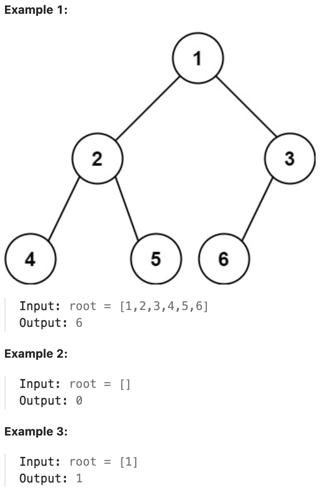

# 222.Count Complete Tree Nodes

## LeetCode 链接

[222.完全二叉树的节点个数](https://leetcode.cn/problems/count-complete-tree-nodes/)

## 题目大意

给你一棵完全二叉树的根节点 `root`，求出该树的节点个数

完全二叉树的定义如下：在完全二叉树中，除了最底层节点可能没填满外，其余每层节点数都达到最大值，并且最下面一层的节点都集中在该层最左边的若干位置。若最底层为第 `h` 层（从第 `0` 层开始），则该层包含 `1 ~ 2h` 个节点



限制：
- The number of nodes in the tree is in the range [0, 5 * 10^4].
- 0 <= Node.val <= 5 * 10^4
- The tree is guaranteed to be complete.

## 解题

一棵完全二叉树的两棵子树，至少有一棵是满二叉树

计算满二叉树的节点个数不用一个个节点去数，可直接通过树高算出来，这也是这道题提高效率的关键点

```js
var countNodes = function(root) {
    if (root == null) return 0;
    let hl = getHeight(root, true);
    let hr = getHeight(root, false);

    if (hl == hr) return Math.pow(2, hl) - 1;
    return 1 + countNodes(root.left) + countNodes(root.right);
};

var getHeight = function(node, isLeft) {
    let height = 0;
    while (node != null) {
        height++;
        node = isLeft ? node.left : node.right;
    }
    return height;
};
```
```python
class Solution:
    def countNodes(self, root: Optional[TreeNode]) -> int:
        l = root
        r = root
        # 记录左、右子树的高度
        hl = 0
        hr = 0

        while l is not None:
            l = l.left
            hl += 1
        
        while r is not None:
            r = r.right
            hr += 1
        
        # 如果左右子树的高度相同，则是一棵满二叉树
        # 节点数 = 2^hl − 1
        if hl == hr:
            return (2 ** hl) - 1
        
        # 如果左右高度不同，则按照普通二叉树的逻辑计算
        # 1 是根节点
        return 1 + self.countNodes(root.left) + self.countNodes(root.right)
```

- 时间复杂度：
  - 计算左右子树高度：`O(logn)`
  - 递归遍历每个子树（最多 `logn` 层）：`O(log²n)`
  - 最终复杂度：`O(log²n)` —— 远优于普通遍历 `O(n)`
- 空间复杂度：递归栈最多 `logn` 层，所以 `O(logn)`


