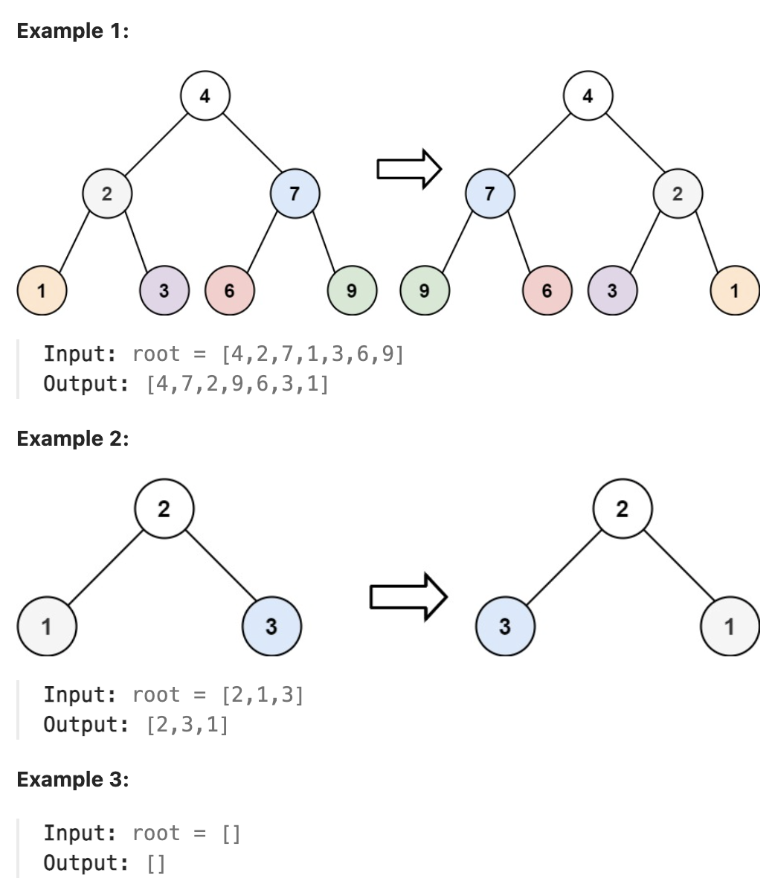

# 226.Invert Binary Tree

## LeetCode 题目链接

[226.翻转二叉树](https://leetcode.cn/problems/invert-binary-tree/)

## 题目大意

给一棵二叉树的根节点 `root`，翻转这棵二叉树，并返回其根节点



限制:
- The number of nodes in the tree is in the range [0, 100].
- -100 <= Node.val <= 100

## 解题

### 思路 1: 迭代/层次遍历

```js
// 前序
var invertTree = function(root) {
    if (root == null) return null;
    let stack = [root]  
    while (stack.length) {
        let cur = stack.pop()  
        let temp = cur.left;
        cur.left = cur.right;
        cur.right = temp;
        if (cur.left) stack.push(cur.left);
        if (cur.right) stack.push(cur.right);
    }
    return root;
};

// 层次
var invertTree = function(root) {
    if (root == null) return null;
    let que = [root];
    while (que.length) {
        let size = que.length;
        while (size -- > 0) {
            let cur = que.shift();
            let temp = cur.left;
            cur.left = cur.right;
            cur.right = temp;
            if (cur.left) que.push(cur.left);
            if (cur.right) que.push(cur.right);
        }
    }
    return root;
};
```
```python
# 前序
class Solution:
    def invertTree(self, root: Optional[TreeNode]) -> Optional[TreeNode]:
        if not root:
            return None
        stack = [root]     

        while stack:
            cur = stack.pop()   
            cur.left, cur.right = cur.right, cur.left                   
            if cur.left:
                stack.append(cur.left)

            if cur.right:
                stack.append(cur.right)  
                
        return root

# 层次
class Solution:
    def invertTree(self, root: Optional[TreeNode]) -> Optional[TreeNode]:
        if not root:
            return None
        que = collections.deque([root])  

        while que:
            size = len(que)
            for _ in range(size):
                cur = que.popleft()
                cur.left, cur.right = cur.right, cur.left
                if cur.left:
                    que.append(cur.left)
                    
                if cur.right:
                    que.append(cur.right)   
                      
        return root
```

- 时间复杂度：`O(n)`
- 空间复杂度：
  - `BFS` (Queue)：`O(n)`
  - `DFS` (Stack)：`O(n)` (最坏情况下，不平衡树)；`O(logn)` (最好情况下，平衡树)

### 思路 2: DFS

```js
// 写法 1
var invertTree = function(root) {
    if (root == null) return null;
    let left = invertTree(root.left);
    let right = invertTree(root.right);
    root.left = right;
    root.right = left;
    return root;
};

// 写法 2
var invertTree = function(root) {
    traverse(root);
    return root;
};

var traverse = function(root) {
    if (root == null) return;
    let cur = root.left;
    root.left = root.right;
    root.right = cur;

    traverse(root.left);
    traverse(root.right);
};
```
```python
# 写法 1
class Solution:
    def invertTree(self, root: Optional[TreeNode]) -> Optional[TreeNode]:
        if not root:
            return None
        
        left = self.invertTree(root.left)
        right = self.invertTree(root.right)
        root.left = right
        root.right = left
        return root

# 写法 2
class Solution:
    def invertTree(self, root: Optional[TreeNode]) -> Optional[TreeNode]:
        self.traverse(root)
        return root
    
    def traverse(self, root):
        if not root:
            return None
        
        cur = root.left
        root.left = root.right
        root.right = cur
        self.traverse(root.left)
        self.traverse(root.right)
```

- 时间复杂度：`O(n)`，其中 `n` 是二叉树的节点数目。
- 空间复杂度：`O(n)`，递归函数需要用到栈空间，栈空间取决于递归深度，最坏情况下递归深度为 `n`