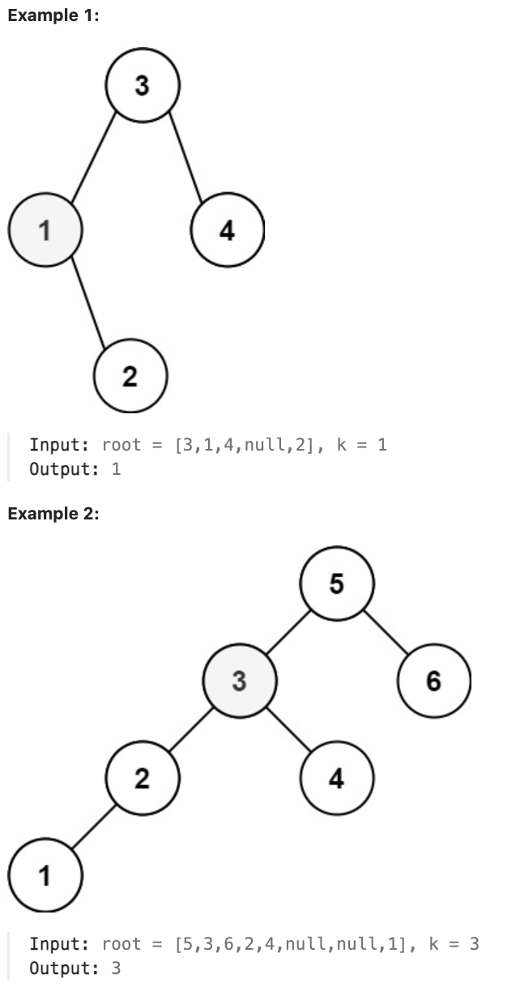

# 230.Kth Smallest Element in a BST

## LeetCode 题目链接

[230.二叉搜索树中第 K 小的元素](https://leetcode.cn/problems/kth-smallest-element-in-a-bst/)

## 题目大意

给定一个二叉搜索树的根节点 `root`，和一个整数 `k`，请设计一个算法查找其中第 `k` 小的元素（从 `1` 开始计数）



限制:
- The number of nodes in the tree is n.
- 1 <= k <= n <= 10^4
- 0 <= Node.val <= 10^4

## 解题

`BST` 的中序遍历结果是有序的（升序），所以用一个外部变量记录中序遍历结果，第 `k` 个元素即是第 `k` 小的元素

```js
var kthSmallest = function(root, k) {
    let res = 0, rank = 0;
    const traverse = function(root, k) {
        if (root == null) return null;
        traverse(root.left, k);
        rank++;
        if (k == rank) {
            res = root.val;
            return;
        }
        traverse(root.right, k);
    };
    // 利用 BST 的中序遍历特性
    traverse(root, k);
    return res;
};
```
```python
class Solution:
    def kthSmallest(self, root: Optional[TreeNode], k: int) -> int:
        self.res = 0
        self.rank = 0
        self.traverse(root, k)
        return self.res
    
    def traverse(self, root, k):
        if not root:
            return None

        self.traverse(root.left, k)
        self.rank += 1

        if self.rank == k:
            self.res = root.val
            return
            
        self.traverse(root.right, k)
```

- 时间复杂度：`O(n)`（最坏情况），`O(k)`（最好情况，找到第 k 小的元素后即会提前停止遍历）
- 空间复杂度：`O(n)`（最坏情况），`O(log n)`（最好情况，平衡树）