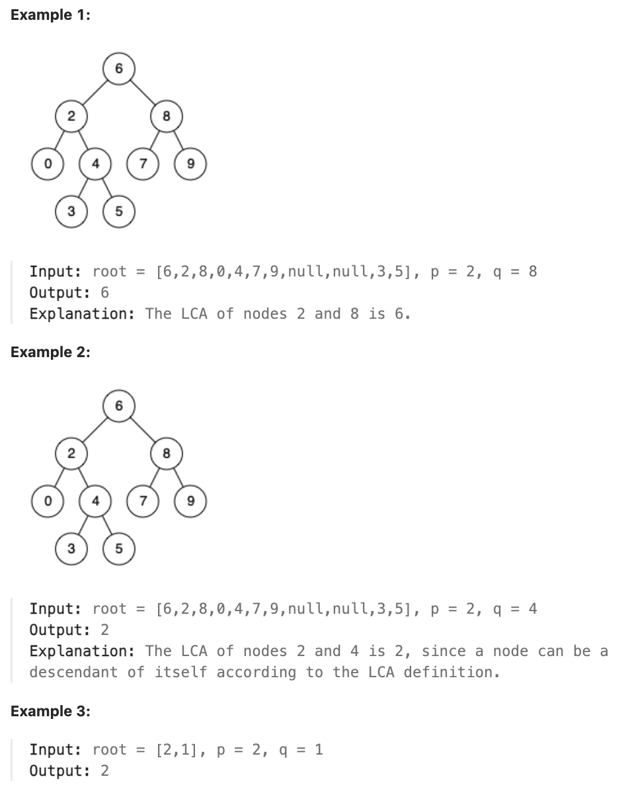

# 235.Lowest Common Ancestor of a Binary Search Tree

## LeetCode 题目链接

[235.二叉搜索树的最近公共祖先](https://leetcode.cn/problems/lowest-common-ancestor-of-a-binary-search-tree/)

## 题目大意

给定一个二叉搜索树, 找到该树中两个指定节点的最近公共祖先

百度百科中最近公共祖先的定义为：“对于有根树 `T` 的两个结点 `p`、`q`，最近公共祖先表示为一个结点 `x`，满足 `x` 是 `p`、`q` 的祖先且 `x` 的深度尽可能大（一个节点也可以是它自己的祖先）”



限制:
- The number of nodes in the tree is in the range [2, 10^5].
- -10^9 <= Node.val <= 10^9
- All Node.val are unique.
- p != q
- p and q will exist in the BST.

## 解题

主要利用 `BST` 左小右大（左子树所有节点都比当前节点小，右子树所有节点都比当前节点大）的特点
- 若 `p` 和 `q` 都比当前节点小，显然 `p` 和 `q` 都在左子树，则其 `LCA` 在左子树
- 若 `p` 和 `q` 都比当前节点大，显然 `p` 和 `q` 都在右子树，则其 `LCA` 在右子树
- 当 `p` 和 `q` 在当前节点的两侧，说明当前节点就是 `LCA`

### 思路 1: 递归

```js
var lowestCommonAncestor = function(root, p, q) {
    if (root == null) return null;
    // 保证 p.val <= q.val，便于后续情况讨论
    if (p.val > q.val) return lowestCommonAncestor(root, q, p);
    if (root.val >= p.val && root.val <= q.val) return root;
    // if(root.val > p.val && root.val > q.val) return lowestCommonAncestor(root.left, p, q);
    if (root.val > q.val) return lowestCommonAncestor(root.left, p, q);
    if (root.val < p.val) return lowestCommonAncestor(root.right, p, q);
    return root;
};
```
```python
class Solution(object):
    def lowestCommonAncestor(self, root, p, q):
        if not root: 
            return None
        # 确保 p.val 小于等于 q.val 后，可以减少后续代码中对 p 和 q 大小关系的判断和处理
        # 在后续比较中，p.val 可以看作“左边”节点，q.val 可以看作“右边”节点，而不用担心它们的大小关系混乱
        if p.val > q.val:
            return self.lowestCommonAncestor(root, q, p)
        
        if root.val >= p.val and root.val <= q.val:
            return root
        # 如果 p 和 q 都位于当前节点的左侧（即 q.val < root.val），则应继续在左子树中查找
        if root.val > q.val:
            return self.lowestCommonAncestor(root.left, q, p)
        
        # 如果 p 和 q 都位于当前节点的右侧（即 p.val > root.val），则应继续在右子树中查找
        if root.val < p.val: 
            return self.lowestCommonAncestor(root.right, p, q)
        
        return root
```

- 时间复杂度：`O(h)`，`h` 是二叉搜索树的高度，该算法的时间复杂度取决于遍历树的深度
  - 在最坏情况下（如二叉搜索树退化成链表），需遍历树的所有节点，时间复杂度为 `O(n)`，`n` 是树的节点数
  - 在平衡二叉搜索树中，树的高度 `h` 为 `log(n)` 级别，因此时间复杂度为 `O(log(n))`
- 空间复杂度：`O(h)`，`h` 是二叉搜索树的高度
  - 该算法是基于递归的，在递归调用栈中会存储每个递归过程中的函数信息
  - 在最坏情况下（树的高度为 `h`），递归调用栈的深度也为 `h`，因此空间复杂度为 `O(h)`
  - 在平衡二叉搜索树中，树的高度 `h` 为 `log(n)` 级别，因此空间复杂度为 `O(log(n))`

### 思路 2: 迭代

```js
var lowestCommonAncestor = function(root, p, q) {
     while (true) {
        if (root.val > p.val && root.val > q.val) {
            root = root.left;
        } else if (root.val < p.val && root.val < q.val) {
            root = root.right;
        } else {
            break;
        }
    }
    
    return root;
};
```
```python
class Solution(object):
    def lowestCommonAncestor(self, root, p, q):
        # 简化条件判断：while True 可以让我们专注于循环内部的逻辑，而不用担心循环条件的复杂性，在循环内部可根据具体的条件（如 root 是否位于 p 和 q 之间）使用 break 语句直接退出循环，而不用在 while 的条件中定义过多判断
        # 如果使用 while root，则需要在循环内部不断判断 root 是否为空，且在 root 为空时跳出循环。相比之下，while True 可以通过 break 更灵活地控制退出时机
        while True:
            if root.val > p.val and root.val > q.val:
                root = root.left
            elif root.val < p.val and root.val < q.val:
                root = root.right
            else:
                break
        
        return root
```

- 时间复杂度: `O(log n)` 对于平衡 `BST`；`O(n)` 对于非平衡 `BST`
- 空间复杂度: `O(1)`