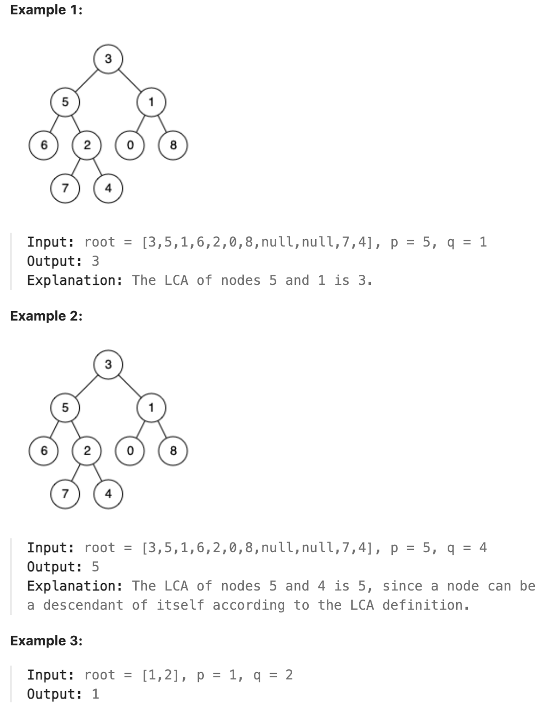

# 236.Lowest Common Ancestor of a Binary Tree

## LeetCode 题目链接

[236.二叉树的最近公共祖先](https://leetcode.cn/problems/lowest-common-ancestor-of-a-binary-tree/)

## 题目大意

给定一个二叉树, 找到该树中两个指定节点的最近公共祖先

百度百科中最近公共祖先的定义为：“对于有根树 `T` 的两个节点 `p`、`q`，最近公共祖先表示为一个节点 `x`，满足 `x` 是 `p`、`q` 的祖先且 `x` 的深度尽可能大（一个节点也可以是它自己的祖先）”



限制:
- The number of nodes in the tree is in the range [2, 10^5].
- -10^9 <= Node.val <= 10^9
- All Node.val are unique.
- p != q
- p and q will exist in the tree.

## 解题

情况 1：若 `p` 和 `q` 都在以 `root` 为根的树中，则 `left` 和 `right` 一定分别是 `p` 和 `q`

情况 2：若 `p` 和 `q` 都不在以 `root` 为根的树中，直接返回 `null`

情况 3：若 `p` 和 `q` 只有一个存在于 `root` 为根的树中，函数返回该节点

### 思路 1: 递归

```js
var lowestCommonAncestor = function(root, p, q) {
    if (root == null) return null;
    if (root == p || root == q) return root;
    let left = lowestCommonAncestor(root.left, p, q);
    let right = lowestCommonAncestor(root.right, p, q);
    if (left != null && right != null) return root;
    if (left == null && right == null) return null;
    return left == null ? right : left;
};
```
```python
class Solution:
    def lowestCommonAncestor(self, root: 'TreeNode', p: 'TreeNode', q: 'TreeNode') -> 'TreeNode':
        if root is None:
            return None
        
        if root == p or root == q:
            return root
        
        left = self.lowestCommonAncestor(root.left, p, q)
        right = self.lowestCommonAncestor(root.right, p, q)

        if left is not None and right is not None:
            return root
        
        if left is None and right is None:
            return None
        
        return left if right is None else right
```

- 时间复杂度：`O(n)`，每个节点最多被访问一次，其中 `n` 是树中节点的总数
- 空间复杂度：`O(h)`，空间复杂度主要取决于递归栈的深度，递归的最大深度等于树的高度 `h`
  - 在最坏的情况下（例如链状树），空间复杂度为 `O(n)`
  - 对于平衡二叉树，空间复杂度是 `O(log n)`

### 思路 2: 迭代

```js
var lowestCommonAncestor = function(root, p, q) {
    let max = Number.MAX_VALUE;  // 设置一个标记值
    let stack = [];  // 用数组模拟栈
    let pre = null;  // 记录上一个遍历的节点
    while (root !== null || stack.length > 0) {
        // 不断深入左子树，直到找到最左节点
        while (root !== null) {
            stack.push(root);
            root = root.left;
        }
        let cur = stack.pop();  // 弹出栈顶节点
        if (cur.right === null || cur.right === pre) {  // 右子树为空或已访问过
            // 检查当前节点是否是 p 或 q
            if (cur === p || cur === q) {
                // 如果当前节点的左右子节点中有一个是目标节点（已标记 max），返回当前节点
                if ((cur.left !== null && cur.left.val === max) || (cur.right !== null && cur.right.val === max)) {
                    return cur;
                }
                cur.val = max;  // 标记当前节点已找到
            }

            // 如果当前节点的左右子节点都已标记，则当前节点是 LCA
            if (cur.left !== null && cur.left.val === max && cur.right !== null && cur.right.val === max) {
                return cur;
            }

            // 如果当前节点有一个子节点被标记为 max，则继续向上传递标记
            if ((cur.left !== null && cur.left.val === max) || (cur.right !== null && cur.right.val === max)) {
                cur.val = max;
            }

            pre = cur;  // 更新 pre 为当前节点
            cur = null;  // 设置 cur 为 null，避免重复访问
        } else {
            stack.push(cur);  // 如果右子树未访问过，将当前节点重新压栈
            root = cur.right;  // 访问右子树
        }
    }
    return null;  // 未找到 LCA 返回 null
};
```
```python
class Solution:
    def lowestCommonAncestor(self, root: 'TreeNode', p: 'TreeNode', q: 'TreeNode') -> 'TreeNode':
        max_val = float('inf')  # 设置标记值
        stack = []  # 使用列表模拟栈
        pre = None  # 记录上一个遍历的节点

        while root is not None or stack:
            # 不断深入左子树，直到最左端节点
            while root is not None:
                stack.append(root)
                root = root.left

            cur = stack.pop()  # 弹出栈顶元素

            # 如果右子树为空或者已经访问过
            if cur.right is None or cur.right == pre:
                # 如果当前节点是 p 或 q
                if cur == p or cur == q:
                    # 如果当前节点的左右子节点中有一个已被标记，则返回当前节点
                    if (cur.left is not None and cur.left.val == max_val) or (cur.right is not None and cur.right.val == max_val):
                        return cur
                    cur.val = max_val  # 标记当前节点
                
                # 如果左右子节点都被标记，说明当前节点是 LCA
                if cur.left is not None and cur.left.val == max_val and cur.right is not None and cur.right.val == max_val:
                    return cur

                # 如果当前节点有一个子节点被标记为 max_val，则继续向上传递标记
                if (cur.left is not None and cur.left.val == max_val) or (cur.right is not None and cur.right.val == max_val):
                    cur.val = max_val

                pre = cur  # 更新 pre 为当前节点
                cur = None  # 设置 cur 为 None，以便避免重复访问
            else:
                stack.append(cur)  # 如果右子树未访问过，将当前节点重新压栈
                root = cur.right  # 访问右子树
        
        return None  # 如果未找到 LCA，返回 None
```

- 时间复杂度：`O(n)`，因为每个节点最多被访问两次
- 空间复杂度：`O(h)`，其中 `h` 是树的高度
  - 最坏情况下为 `O(n)`
  - 最优情况下为 `O(logn)`