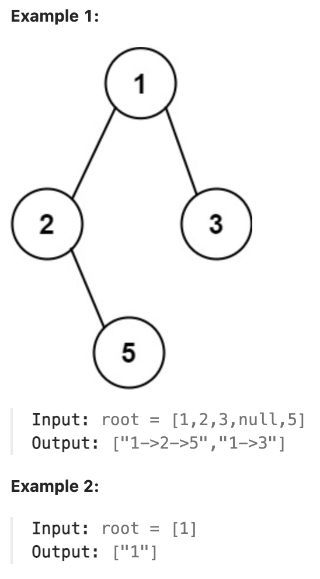

# 257.Binary Tree Paths

## LeetCode 题目链接

[257.二叉树的所有路径](https://leetcode.cn/problems/binary-tree-paths/)

## 题目大意

给一个二叉树的根节点 `root`，按任意顺序返回所有从根节点到叶子节点的路径

叶子节点是指没有子节点的节点



限制：
- The number of nodes in the tree is in the range [1, 100].
- -100 <= Node.val <= 100

## 解题

### 思路 1: 递归 - DFS

```js
var binaryTreePaths = function(root) {
    const res = [], path = [];
    const traverse = function(root) {
        if (root == null) return;
        if (root.left == null && root.right == null) {
            path.push(root.val + "");
            res.push(path.join("->"));
            path.pop();
            return;
        }
        path.push(root.val + "");
        traverse(root.left);
        traverse(root.right);
        path.pop();
    };
    
    traverse(root);
    return res;
};
```
```python
class Solution:
    def binaryTreePaths(self, root: Optional[TreeNode]) -> List[str]:
        res = []
        # 用于记录当前遍历过程中到达某个节点的路径（该路径会不断变化，在递归调用中添加或删除节点）
        path = []
        self.traverse(root, res, path)
        return res

    def traverse(self, root, res, path):
        if root == None:
            return
            
        # root 是叶子节点
        if root.left is None and root.right is None:
            path.append(str(root.val))
            # 将这条路径装入 res
            res.append("->".join(path))
            path.pop()
            return
        
        # 前序遍历位置
        path.append(str(root.val))
        # 递归遍历左右子树
        self.traverse(root.left, res, path)
        self.traverse(root.right, res, path)
        # 后序遍历位置
        path.pop()
```

- 时间复杂度：`O(n)`，每个节点访问一次
- 空间复杂度：`O(h)`，递归栈和 `path` 列表的空间复杂度，在最坏情况下（链表结构的树）为 `O(n)`

### 思路 2: 迭代

```js
var binaryTreePaths = function(root) {
    if (!root) return [];
    const stack = [root], paths = [''], res = [];
    while (stack.length) {
        const node = stack.pop();
        let path = paths.pop();
        if (!node.left && !node.right) { // 到叶子节点终止, 添加路径到结果中
            res.push(path + node.val);
            continue;
        }

        path += node.val + '->';

        if (node.right) { // 右节点存在
            stack.push(node.right);
            paths.push(path);
        }

        if (node.left) { // 左节点存在
            stack.push(node.left);
            paths.push(path);
        }
    }
    
    return res;
};
```
```python
class Solution:
    def binaryTreePaths(self, root: Optional[TreeNode]) -> List[str]:
        # 题目中节点数至少为 1
        stack, pathStr, res = [root], [str(root.val)], []
        while stack:
            cur = stack.pop()
            path = pathStr.pop()
            # 当前节点为叶子节点，添加路径到结果中
            if not cur.left and not cur.right:
                res.append(path)
            
            if cur.right:
                stack.append(cur.right)
                pathStr.append(path + "->" + str(cur.right.val))
                
            if cur.left:
                stack.append(cur.left)
                pathStr.append(path + "->" + str(cur.left.val))
        
        return res
```

- 时间复杂度：`O(n)`
- 空间复杂度：`O(n^2)` 在最坏情况下