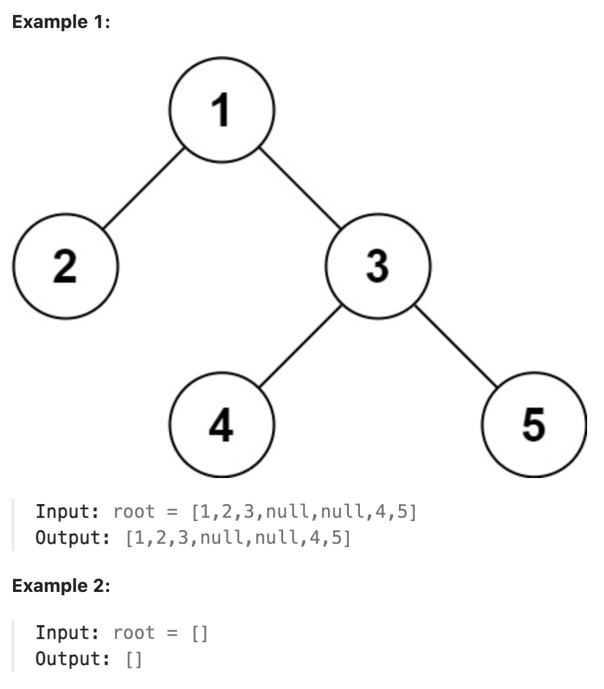

# 297.Serialize and Deserialize Binary Tree

## LeetCode 题目链接

[297.二叉树的序列化与反序列化](https://leetcode.cn/problems/serialize-and-deserialize-binary-tree/)

## 题目大意

序列化是将一个数据结构或对象转换为连续的比特位的操作，进而可以将转换后的数据存储在一个文件或者内存中，同时也可以通过网络传输到另一个计算机环境，采取相反方式重构得到原数据

请设计一个算法来实现二叉树的序列化与反序列化。这里不限定你的序列/反序列化算法执行逻辑，只需保证一个二叉树可被序列化为一个字符串且将这个字符串反序列化为原始的树结构



限制：
- The number of nodes in the tree is in the range [0, 10^4].
- -1000 <= Node.val <= 1000

## 解题

`JSON` 的运用非常广泛，如经常将编程语言中的结构体序列化成 `JSON` 字符串，存入缓存或通过网络发送给远端服务，消费者接受 `JSON` 字符串然后进行反序列化，就可得到原始数据

这就是序列化和反序列化的目的，以某种特定格式组织数据，使得数据可以独立于编程语言

当二叉树中节点的值不存在重复时：
- 若序列化结果中不包含空指针的信息，且只给出一种遍历顺序，则无法还原出唯一的一棵二叉树
- 若序列化结果中不包含空指针的信息，且会给出两种遍历顺序，则分两种情况：
  - 若给出的是前序和中序，或后序和中序，则可还原出唯一的一棵二叉树
  - 若给出前序和后序，则无法还原出唯一的一棵二叉树
- 弱序列化结果中包含空指针的信息，且只给出一种遍历顺序，也要分两种情况：
  - 若给出的是前序或者后序，则可以还原出唯一的一棵二叉树
  - 若给出的是中序，则无法还原出唯一的一棵二叉树

### 思路 1: 递归

```js
/**
 * Definition for a binary tree node.
 * function TreeNode(val) {
 *     this.val = val;
 *     this.left = this.right = null;
 * }
 */
/**
 * Encodes a tree to a single string.
 *
 * @param {TreeNode} root
 * @return {string}
 */
var serialize = function(root) {
    if (root === null) return 'None';
    return root.val + ',' + serialize(root.left) + ',' + serialize(root.right);
};

/**
 * Decodes your encoded data to tree.
 *
 * @param {string} data
 * @return {TreeNode}
 */
var deserialize = function(data) {
    const nodes = data.split(',');
    const dfs = function(nodes) {
        const cur = nodes.shift();
        if (cur == "None") return null;
        const root = new TreeNode(parseInt(cur));
        root.left = dfs(nodes);
        root.right = dfs(nodes);
        return root;
    };
    return dfs(nodes);
};
```
```python
class Codec:
    def serialize(self, root):
        if not root:
            return "None"

        return str(root.val) + "," + self.serialize(root.left) + "," + self.serialize(root.right)
        
    def deserialize(self, data):
        datalist = data.split(',')

        def dfs(nodes):
            cur = nodes.pop(0)
            if cur == "None":
                return None
            root = TreeNode(int(cur))
            root.left = dfs(nodes)
            root.right = dfs(nodes)
            return root
        
        return dfs(datalist)
```

- 时间复杂度：`O(n)` 对于序列化和反序列化
- 空间复杂度：`O(n)` 对于序列化和反序列化

### 思路 2: 层序遍历

```js
const SEP = ",";
const NULL = "#";
/**
 * Encodes a tree to a single string.
 *
 * @param {TreeNode} root
 * @return {string}
 */
var serialize = function(root) {
    if (root == null) return "";
    let str = "";
    // 初始化队列，将 root 加入队列
    let que = [root];
    while (que.length) {
        let size = que.length;
        for (let i = 0; i < size; i++) {
            let cur = que.shift();
            if (cur == null) {
                str += (NULL + SEP);
                continue;
            }
            str += (cur.val + SEP);
            que.push(cur.left);
            que.push(cur.right);
        }
    }
    return str;
};

/**
 * Decodes your encoded data to tree.
 *
 * @param {string} data
 * @return {TreeNode}
 */
var deserialize = function(data) {
    if (data.length === 0) return null;
    let nodes = data.split(SEP);
    // 第一个元素就是 root 的值
    let root = new TreeNode(parseInt(nodes[0]));
    // 队列 que 记录父节点，将 root 加入队列
    let que = [root];

    // index 变量记录正在序列化的节点在数组中的位置
    let index = 1;
    while (que.length) {
        let size = que.length;
        for (let i = 0; i < size; i++) {
            let parent = que.shift();
            // 为父节点构造左侧子节点
            let left = nodes[index++];
            if (left !== NULL) {
                parent.left = new TreeNode(parseInt(left));
                que.push(parent.left);
            }
            
            // 为父节点构造右侧子节点
            let right = nodes[index++];
            if (right !== NULL) {
                parent.right = new TreeNode(parseInt(right));
                que.push(parent.right);
            }
        }
    }
    return root;
};
```
```python
class Codec:
    def __init__(self):
        self.SEP = ","
        self.NULL = "#"

    def serialize(self, root):
        if not root:
            return ""
    
        res = []
        que = [root]  # 初始化队列，将 root 加入队列
        while que:
            node = que.pop(0)  # 取出队首元素
            if node:
                res.append(str(node.val))  # 将节点值加入结果中
                que.append(node.left)       # 将左子节点加入队列
                que.append(node.right)      # 将右子节点加入队列
            else:
                res.append(self.NULL)           # 如果是空节点，加入 NULL 标识

        return self.SEP.join(res)  # 用指定的分隔符 SEP 将结果列表转换为字符串

    def deserialize(self, data):
        if not data:
            return None

        nodes = data.split(self.SEP)  # 将字符串分割为列表
        root = TreeNode(int(nodes[0]))  # 第一个元素就是 root 的值
        que = [root]  # 用队列记录父节点，将 root 加入队列
        index = 1  # 记录正在反序列化的节点在数组中的位置

        while que:
            parent = que.pop(0)  # 取出队首元素作为父节点

            # 为父节点构造左侧子节点
            left_val = nodes[index]
            index += 1
            if left_val != self.NULL:  # 如果左节点不是 NULL，创建左子节点
                parent.left = TreeNode(int(left_val))
                que.append(parent.left)

            # 为父节点构造右侧子节点
            right_val = nodes[index]
            index += 1
            if right_val != self.NULL:  # 如果右节点不是 NULL，创建右子节点
                parent.right = TreeNode(int(right_val))
                que.append(parent.right)

        return root  # 返回根节点
```

- 时间复杂度：`O(n)` 对于序列化和反序列化
- 空间复杂度：`O(n)` 对于序列化和反序列化

### 上述两种方式的对比

实际性能：
- `BFS` 方法可能在处理宽而浅的树时更有效
- `DFS` 方法可能在处理深而窄的树时更有效