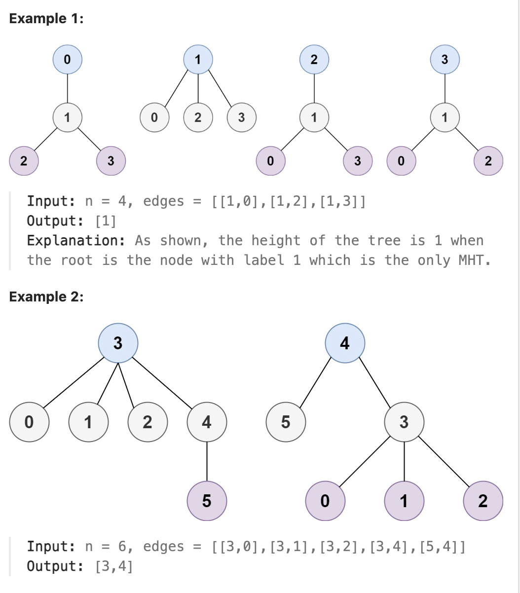

# 310.Minimum Height Trees

## LeetCode 题目链接

[310.最小高度树](https://leetcode.cn/problems/minimum-height-trees/)

## 题目大意

树是一个无向图，其中任何两个顶点只通过一条路径连接；换句话说，任何一个没有简单环路的连通图都是一棵树

给你一棵包含 `n` 个节点的树，标记为 `0` 到 `n - 1`。给定数字 `n` 和一个有 `n - 1` 条无向边的 `edges` 列表（每一个边都是一对标签），其中 `edges[i] = [a_i, b_i]` 表示树中节点 `a_i` 和 `b_i` 之间存在一条无向边

可选择树中任何一个节点作为根。当选择节点 `x` 作为根节点时，设结果树的高度为 `h`。在所有可能的树中，具有最小高度的树（即，`min(h)`）被称为最小高度树 

请你找到所有的 最小高度树 并按 任意顺序 返回它们的根节点标签列表

树的 高度 是指根节点和叶子节点之间最长向下路径上边的数量



限制：
- 1 <= n <= 2 * 10^4
- edges.length == n - 1
- 0 <= a_i, b_i < n
- a_i != b_i
- All the pairs (a_i, b_i) are distinct.
- The given input is guaranteed to be a tree and there will be no repeated edges.

## 解题

可以将问题转化为“从叶子节点到中心节点”的问题，即找出树的“中心节点”或“中心点”

树的性质：
- 树是一个`无环连通图`，因此必然存在一个或两个中心节点，使得树的高度最小
- 如果从叶子节点开始去掉节点，逐步向内部收缩，最终剩下的一个或两个节点就是树的中心节点
  
使用拓扑排序（`Topological Sorting`）处理树：
- 从所有的叶子节点开始，每次移除叶子节点并更新其相邻节点的度（即与该节点相邻的边数）
- 重复上述步骤，直到剩下的节点数小于等于 `2`，此时剩下的节点即为树的最小高度树的根节点

```js
// 写法 1
var findMinHeightTrees = function(n, edges) {
    // 如果只有一个节点，直接返回该节点
    if(n === 1) return [0];  
    // 构建邻接表
    const graph = new Map();
    // 无向图，等同于双向图
    for(let [u, v] of edges) {
        if (!graph.has(u)) graph.set(u, new Set());
        if (!graph.has(v)) graph.set(v, new Set());
        graph.get(u).add(v);
        graph.get(v).add(u);
    }
    // 初始化所有度为 1 的叶子节点
    let leaves = [];
    for(let [node, neighbors] of graph) {
        if (neighbors.size === 1) leaves.push(node);
    }
    // 不断删除叶子节点，直到剩下的节点数小于等于 2 个
    let remainingNodes = n;
    while(remainingNodes > 2) {
        const leavesSize = leaves.length;
        remainingNodes -= leavesSize;
        // 处理当前的所有叶子节点
        const newLeaves = [];
        for(let i = 0; i < leavesSize; i++) {
            const leaf = leaves[i];
            const neighbors = graph.get(leaf);
            for(let neighbor of neighbors) {
                graph.get(neighbor).delete(leaf);
                if(graph.get(neighbor).size === 1) newLeaves.push(neighbor);
            }
        }
        leaves = newLeaves;
    }
    // 剩下的节点即为树的最小高度树的根节点
    return leaves;
}

// 写法 2
var findMinHeightTrees = function(n, edges) {
    if (n === 1) {
        // base case，只有一个节点 0 的话，无法形成边，所以直接返回节点 0
        return [0];
    }
    // 1、构建邻接表
    const graph = Array.from({ length: n }, () => []);
    for (const [u, v] of edges) {
        // 无向图，等同于双向图
        graph[u].push(v);
        graph[v].push(u);
    }

    // 2、找到所有的叶子节点
    const q = [];
    for (let i = 0; i < n; i++) {
        if (graph[i].length === 1) {
            q.push(i);
        }
    }

    // 3、不断删除叶子节点，直到剩下的节点数小于等于 2 个
    let nodeCount = n;
    while (nodeCount > 2) {
        const sz = q.length;
        nodeCount -= sz;
        for (let i = 0; i < sz; i++) {
            // 删除当前叶子节点
            const cur = q.shift();
            // 找到与当前叶子节点相连的节点
            for (const neighbor of graph[cur]) {
                // 将被删除的叶子节点的邻接节点的度减 1
                graph[neighbor] = graph[neighbor].filter(n => n !== cur);
                // 如果删除后，相连节点的度为 1，说明它也变成了叶子节点
                if (graph[neighbor].length === 1) {
                    q.push(neighbor);
                }
            }
        }
    }

    // 4、最后剩下的节点就是根节点
    return q;
}
```
```python
class Solution:
    def findMinHeightTrees(self, n: int, edges: List[List[int]]) -> List[int]:
        if n == 1:
            return [0]  # 如果只有一个节点，直接返回该节点
        
        # 构建邻接表
        graph = defaultdict(set)
        for u, v in edges:
            # 无向图，等同于双向图
            graph[u].add(v)
            graph[v].add(u) 
        
        c
        leaves = deque([i for i in range(n) if len(graph[i]) == 1])

        # 剩余节点数量
        remaining_nodes = n
        while remaining_nodes > 2:
            leaves_size = len(leaves)
            remaining_nodes -= leaves_size
            # 处理当前的所有叶子节点
            
            for _ in range(leaves_size):
                leaf = leaves.popleft()
                # 叶子节点只有一个邻居
                neighbor = graph[leaf].pop()
                graph[neighbor].remove(leaf)
                # 如果邻居变成了叶子节点（度为1），则加入队列
                if len(graph[neighbor]) == 1:
                    leaves.append(neighbor)
                
                # 此处写法 2
                # # 找到与当前叶子节点相连的节点
                # for neighbor in graph[leaf]:
                #     # 将被删除的叶子节点的邻接节点的度减 1
                #     graph[neighbor].remove(leaf)
                #     # 如果删除后，相连节点的度为 1，说明它也变成了叶子节点
                #     if len(graph[neighbor]) == 1:
                #         leaves.append(neighbor)
        
        # 剩下的节点即为树的最小高度树的根节点
        return list(leaves)
```

- 时间复杂度：`O(n)`
  - 构建图和初始化叶子节点需要 `O(n)` 时间
  - 删除叶子节点并更新图结构的时间也是 `O(n)`，因为每个节点和边只会被遍历一次
空间复杂度：`O(n)`
- 使用了邻接表 `graph` 来存储图结构，占用 `O(n)` 空间
- 还使用了 `deque` 来存储叶子节点，占用 `O(n)` 空间