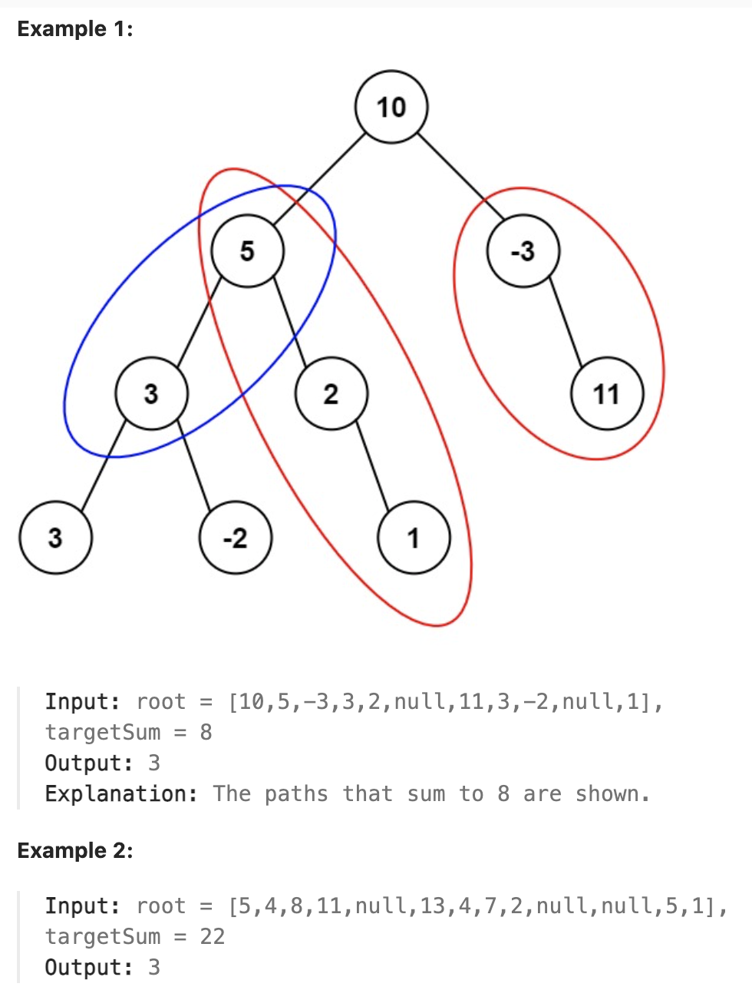

# 437.Path Sum III

## LeetCode 题目链接

[437.路径总和 III](https://leetcode.cn/problems/path-sum-iii/)

## 题目大意

给定一个二叉树的根节点 `root`，和一个整数 `targetSum`，求该二叉树里节点值之和等于 `targetSum` 的路径的数目

路径不需要从根节点开始，也不需要在叶子节点结束，但路径方向必须是向下的（只能从父节点到子节点）



限制：
- The number of nodes in the tree is in the range [0, 1000].
- -10^9 <= Node.val <= 10^9
- -1000 <= targetSum <= 1000

## 解题

可以使用前缀和来优化这个问题。对于每一个节点，记录从根节点到当前节点的路径和 `prefixSum`。对于当前节点的路径和，检查在这条路径之前是否存在一段路径，使得它的路径和恰好为 `prefixSum - targetSum`

> 可以定义节点的前缀和来减少重复计算
> - 节点的前缀和：从根节点到当前节点路径上所有节点的和
> - 有了节点的前缀和，就可通过前缀和来计算两节点之间的路劲和。即：则两节点之间的路径和 = 两节点之间的前缀和之差

具体步骤：
- 使用`DFS`遍历每个节点
- 使用哈希表记录每个前缀和出现的次数：以「当前节点的前缀和」为键，以「该前缀和的节点数量」为值
- 对于当前节点，计算从当前节点往回是否存在一段路径的和等于 `targetSum`，如果存在，增加路径计数
- 递归处理左右子树
- 处理完当前节点后，将当前节点的前缀和从哈希表中移除，避免影响其他路径的计算

```js
var pathSum = function(root, targetSum) {
    const prefixSums = {0: 1};  // 初始化前缀和为 0 的情况
    const dfs = function(node, curSum) {
        if (!node) return 0;
        curSum += node.val;
        let count = prefixSums[curSum - targetSum] || 0;
        // 更新当前前缀和
        prefixSums[curSum] = (prefixSums[curSum] || 0) + 1;

        // 递归遍历左右子树
        count += dfs(node.left, curSum);
        count += dfs(node.right, curSum);
        
        // 递归完成后，减少当前前缀和的次数，避免影响其他路径
        prefixSums[curSum]--;
        
        return count;
    };
    return dfs(root, 0);
};
```
```python
class Solution:
    def pathSum(self, root: Optional[TreeNode], targetSum: int) -> int:
        prefixSums = {0: 1}  # 初始化前缀和为0的情况
        def dfs(node, curSum):
            if not node:
                return 0
            
            # 当前路径和
            curSum += node.val

            # 计算从当前节点往回是否有路径和等于 targetSum
            # 表示存在从前缀和为 curSum - targetSum 所对应的节点到前缀和为 curSum 所对应的节点的路径个数
            count = prefixSums.get(curSum - targetSum, 0)
            # 更新前缀和
            prefixSums[curSum] = prefixSums.get(curSum, 0) + 1

            # 递归左右子树
            count += dfs(node.left, curSum)
            count += dfs(node.right, curSum)

            # 还原前缀和，防止影响其他路径的计算
            prefixSums[curSum] -= 1
        
            return count
        return dfs(root, 0)
```

- 时间复杂度：`O(n)`，`n` 是树中节点的数量。每个节点只被访问一次，且每个节点对哈希表的操作（更新和查询）是常数时间
- 空间复杂度：哈希表 `prefixSums` 在最坏情况下可能存储 `n` 个不同的前缀和，因此空间复杂度为 `O(n)`。此外，递归的深度是树的高度，最坏情况下为 `O(n)`，因此总的空间复杂度也是 `O(n)`