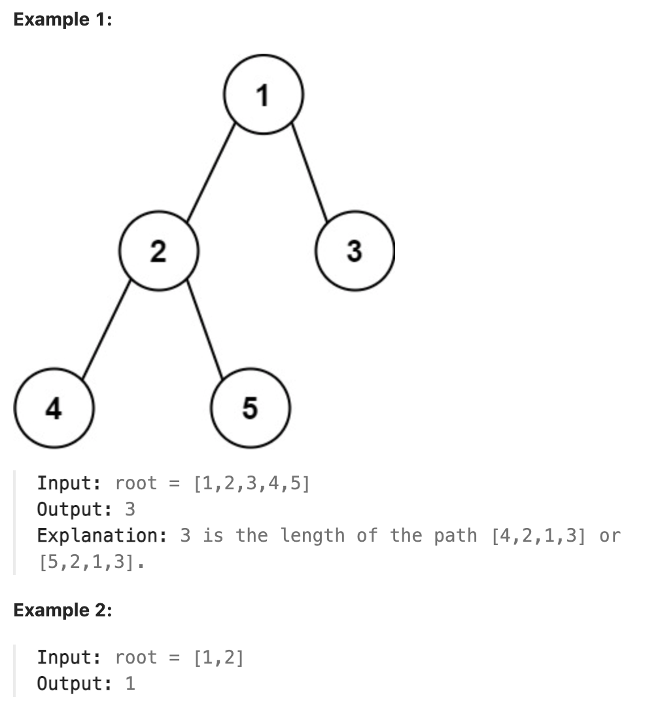

# 543.Diameter of Binary Tree

## LeetCode 题目链接

[543.二叉树的直径](https://leetcode.cn/problems/diameter-of-binary-tree/)

## 题目大意

给一棵二叉树的根节点，返回该树的`直径`

二叉树的`直径`是指树中任意两个节点之间最长路径的`长度`，这条路径可能经过也可能不经过根节点 `root` 

两节点之间路径的`长度`由它们之间边数表示



限制:
- The number of nodes in the tree is in the range [1, 10^4].
- -100 <= Node.val <= 100

## 解题

二叉树的直径，其实就是左右子树的最大深度之和

然而对于根为 `root` 的二叉树来说，其直径长度并不简单等于`左子树高度 + 右子树高度`

根据路径是否穿过根节点，可以将二叉树分为两种：
- 直径长度所对应的路径穿过根节点
- 直径长度所对应的路径不穿过根节点

```js
var diameterOfBinaryTree = function(root) {
    let maxDiameter = 0;

    const getMaxDiameter = function(root) {
        if (root == null) return 0;
        let leftMax = getMaxDiameter(root.left);
        let rightMax = getMaxDiameter(root.right);

        maxDiameter = Math.max(maxDiameter, leftMax + rightMax);
        
        return Math.max(leftMax, rightMax) + 1;
    };

    getMaxDiameter(root);
    return maxDiameter;
};
```
```python
class Solution:
    def diameterOfBinaryTree(self, root: Optional[TreeNode]) -> int:
        self.maxDiameter = 0
        self.getDiameter(root)
        return self.maxDiameter
    
    def getDiameter(self, root):
        if not root:
            return 0
        
        leftMax = self.getDiameter(root.left)
        rightMax = self.getDiameter(root.right)

        # 注意，这里不需要 +1，因为 leftMax 和 rightMax 已经包含了所有经过 root 的节点数总和，不需要再额外增加。
        self.maxDiameter = max(self.maxDiameter, leftMax + rightMax)

        # leftMax 和 rightMax 分别表示当前 root 节点的左子树和右子树的最大深度
        # max(leftMax, rightMax) + 1 表示当前 root 节点到叶子节点的最长路径，即当前节点的深度
        # +1 的原因：在递归调用中，每次返回值表示当前节点到叶子节点的最大深度，所以需在子节点的深度 max(leftMax, rightMax) 基础上再加上当前节点自身的深度 1
        return max(leftMax, rightMax) + 1
```

- 时间复杂度：`O(n)`，其中 `n` 是二叉树的节点数目
- 空间复杂度：`O(n)`，递归函数需要用到栈空间，栈空间取决于递归深度，最坏情况下递归深度为 `n`