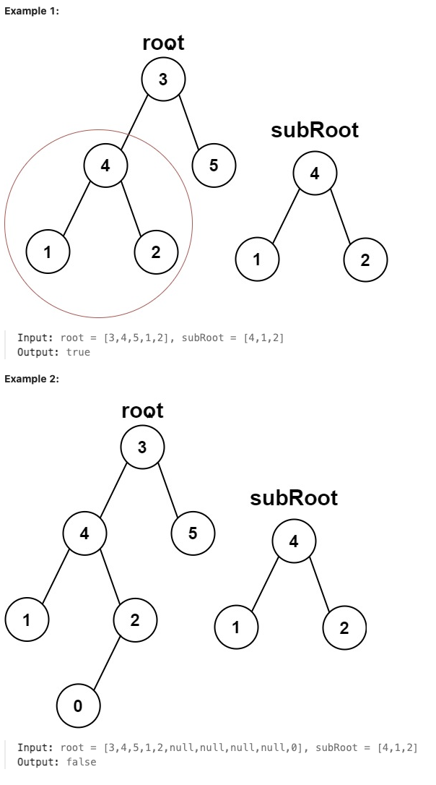

# 572.Subtree of Another Tree

## LeetCode 题目链接

[572.另一棵树的子树](https://leetcode.cn/problems/subtree-of-another-tree/)

## 题目大意

给两棵二叉树 `root` 和 `subRoot`，检验 `root` 中是否包含和 `subRoot` 具有相同结构和节点值的子树。如果存在，返回 `true`；否则，返回 `false` 

二叉树 `tree` 的一棵子树包括 `tree` 的某个节点和这个节点的所有后代节点。`tree` 也可以看做它自身的一棵子树



限制:
- The number of nodes in the root tree is in the range [1, 2000].
- The number of nodes in the subRoot tree is in the range [1, 1000].
- -10^4 <= root.val <= 10^4
- -10^4 <= subRoot.val <= 10^4

## 解题

```js
var isSubtree = function(root, subRoot) {
    if (root == null) return subRoot == null;
    // 判断以 root 为根的二叉树是否和 subRoot 相同
    if (isSameTree(root, subRoot)) return true;
    // 去左右子树中判断是否有和 subRoot 相同的子树
    return isSubtree(root.left, subRoot) || isSubtree(root.right, subRoot);
};

var isSameTree = function(p, q) {
    // 判断一对节点是否相同
    if (p == null && q == null) return true;
    if (p == null || q == null) return false;
    if (p.val != q.val) return false;
    // 判断其他节点是否相同
    return isSameTree(p.left, q.left) && isSameTree(p.right, q.right);
};
```
```python
class Solution:
    def isSubtree(self, root: Optional[TreeNode], subRoot: Optional[TreeNode]) -> bool:
        if not root:
            return subRoot is None
        
        # 判断以 root 为根的二叉树是否和 subRoot 相同
        if self.isSameTree(root, subRoot):
            return True
        
        # 去左右子树中判断是否有和 subRoot 相同的子树
        return self.isSubtree(root.left, subRoot) or self.isSubtree(root.right, subRoot)
    
    def isSameTree(self, p: TreeNode, q: TreeNode) -> bool:
        # 判断一对节点是否相同
        if not p and not q:
            return True
        
        if not p or not q:
            return False
        
        if p.val != q.val:
            return False
        
        # 判断其他节点是否相同
        return self.isSameTree(p.left, q.left) and self.isSameTree(p.right, q.right)
```

- 时间复杂度：`O(m×n)`
  - 最坏情况下，需遍历原树的所有节点，对每个节点都调用 `isSameTree` 方法
  - 假设原树有 `n` 个节点，子树有 `m` 个节点：
    - `isSubtree` 方法在最坏情况下会被调用 `n` 次（遍历原树的每个节点）
    - 对于每次 `isSubtree` 调用，`isSameTree` 方法最多需要 `O(m)` 的时间（比较整个子树）
- 空间复杂度：`O(max(m,n))`
  - 在递归算法中，空间复杂度主要取决于递归调用栈的深度，递归调用栈的深度即为树的最大深度，也就是最大递归层数
  - 由于递归调用栈不会同时嵌套两棵树的递归深度，因此只需取两者中的最大值，而不是两者的和
