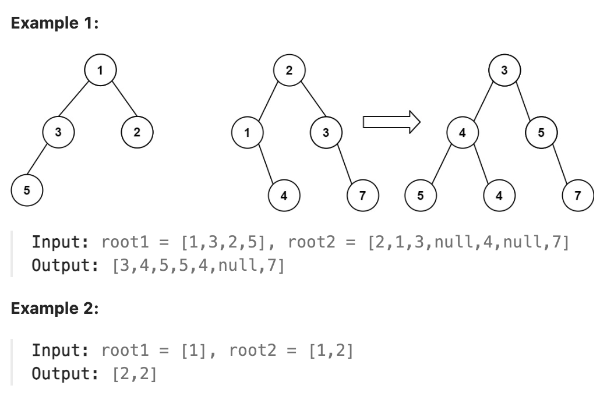

# 617.Merge Two Binary Trees

## LeetCode 题目链接

[617.合并二叉树](https://leetcode.cn/problems/merge-two-binary-trees/)

## 题目大意

给两棵二叉树: `root1` 和 `root2`

想象一下，当将其中一棵覆盖到另一棵之上时，两棵树上的一些节点将会重叠（而另一些不会），需将这两棵树合并成一棵新二叉树

合并的规则是：如两个节点重叠，将这两个节点的值相加作为合并后节点的新值；否则，不为 `null` 的节点将直接作为新二叉树的节点

返回合并后的二叉树

注意: 合并过程必须从两个树的根节点开始



限制:
- The number of nodes in both trees is in the range [0, 2000].
- -10^4 <= Node.val <= 10^4

## 解题

### 思路 1: 递归

```js
// 分解思路
var mergeTrees = function(root1, root2) {
    if (root1 == null) return root2;
    if (root2 == null) return root1;
    root1.val += root2.val;
    root1.left = mergeTrees(root1.left, root2.left);
    root1.right = mergeTrees(root1.right, root2.right);
    return root1;
};

// 遍历的思路
var mergeTrees = function(root1, root2) {
    if (root1 == null) return root2;
    traverse(root1, root2);
    return root1;
};

var traverse = function(root1, root2) {
    if (root1 == null || root2 == null) return;
    if (root1 != null && root2 != null) root1.val += root2.val;
    if (root1.left == null && root2.left != null) {
        root1.left = root2.left;
        root2.left = null;
    }

    if (root1.right == null && root2.right != null) {
        root1.right = root2.right;
        root2.right = null;
    }
    
    traverse(root1.left, root2.left);
    traverse(root1.right, root2.right);
};
```
```python
# 分解思路
class Solution:
    def mergeTrees(self, root1: Optional[TreeNode], root2: Optional[TreeNode]) -> Optional[TreeNode]:
        if not root1:
            return root2
        
        if not root2:
            return root1

        root1.val += root2.val
        root1.left = self.mergeTrees(root1.left, root2.left)
        root1.right = self.mergeTrees(root1.right, root2.right)

        return root1

# 遍历的思路
class Solution:
    def mergeTrees(self, root1: Optional[TreeNode], root2: Optional[TreeNode]) -> Optional[TreeNode]:
        # 若一棵树非空，则合并后就是另一棵树
        if root1 is None:
            return root2
        self.traverse(root1, root2)
        return root1
    
    def traverse(self, root1, root2):
        if not root1 or not root2:
            return None
        
        if root1 and root2:
            root1.val += root2.val
        
        if not root1.left and root2.left:
            root1.left = root2.left
            root2.left = None

        if not root1.right and root2.right:
            root1.right = root2.right
            root2.right = None
        
        self.traverse(root1.left, root2.left)
        self.traverse(root1.right, root2.right)
```

- 时间复杂度：`O(min(n, m))`，`m` 和 `n` 分别是两棵树的节点数，需要遍历两棵树中的所有节点，取决于较小树的节点数
- 空间复杂度：`O(min(h1, h2))`，`h1` 和 `h2` 分别是两棵树的高度，最坏情况下可能为 `O(min(m, n))`

### 思路 2: 迭代

```js
var mergeTrees = function(root1, root2) {
    if (root1 === null) return root2;
    if (root2 === null) return root1;

    let que = [];
    que.push(root1);
    que.push(root2);
    while (que.length) {
        let node1 = que.shift();
        let node2 = que.shift();
        node1.val += node2.val;

        if (node1.left !== null && node2.left !== null) {
            que.push(node1.left);
            que.push(node2.left);
        }

        if (node1.right !== null && node2.right !== null) {
            que.push(node1.right);
            que.push(node2.right);
        }

        if (node1.left === null && node2.left !== null) {
            node1.left = node2.left;
        }

        if (node1.right === null && node2.right !== null) {
            node1.right = node2.right;
        } 
    }

    return root1;
};
```
```python
class Solution:
    def mergeTrees(self, root1: Optional[TreeNode], root2: Optional[TreeNode]) -> Optional[TreeNode]:
        if not root1:
            return root2
        
        if not root2:
            return root1

        que = collections.deque()
        # 初始化队列，用于广度优先遍历
        que.append((root1, root2))

        while que:
            node1, node2 = que.popleft()  # 取出两个节点进行合并
            node1.val += node2.val  # 合并节点的值
            # 如果两个节点的左子树都存在，则加入队列
            if node1.left and node2.left:
                que.append((node1.left, node2.left))
            # 如果 node1 的左子树为空，而 node2 的左子树不为空，则直接将 node2 的左子树连接到 node1
            elif not node1.left:
                node1.left = node2.left
                
            # 同理，处理右子树
            if node1.right and node2.right:
                que.append((node1.right, node2.right))
            elif not node1.right:
                node1.right = node2.right

        return root1  # 返回合并后的根节点
```

- 时间复杂度：`O(min(m, n))`，`m` 和 `n` 分别是两棵树的节点数，因为需遍历两棵树中的每个节点，遍历次数取决于较小树的节点数
- 空间复杂度：`O(min(n, m))`，在最坏情况下可能比递归版本更高，因为递归版本的空间复杂度取决于树的高度，而迭代版本的空间复杂度与节点数直接相关