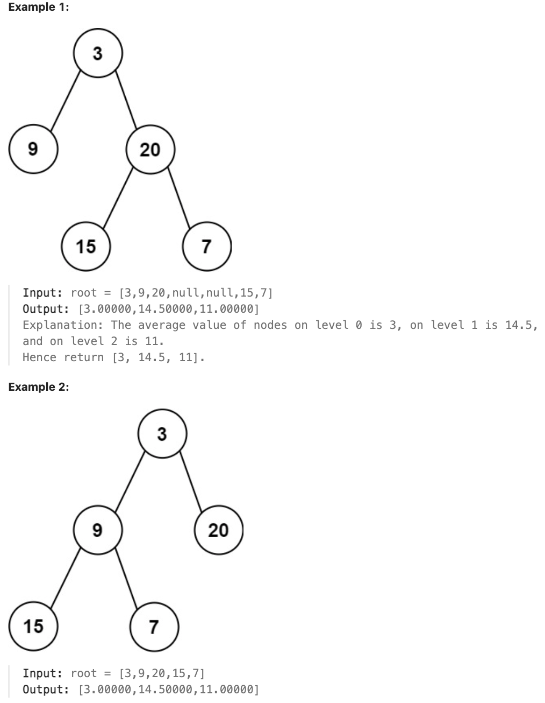

# 637.Average of Levels in Binary Tree

## LeetCode 题目链接

[637.二叉树的层平均值](https://leetcode.cn/problems/average-of-levels-in-binary-tree/)

## 题目大意

给定一个非空二叉树的根节点 `root`, 以数组的形式返回每一层节点的平均值。与实际答案相差 `10^-5` 以内的答案可以被接受
 


限制:
- The number of nodes in the tree is in the range [1, 10^4].
- -2^31 <= Node.val <= 2^31 - 1

## 解题

层序遍历时把一层求个总和再取一个均值

```js
var averageOfLevels = function(root) {
    let res = [];
    if (root == null) return res;
    que = [];
    que.push(root);

    while (que.length > 0) {
        let levelSize = que.length;
        let levelSum = 0.0;
        for (let i = 0; i < levelSize; i++) {
            let cur = que.shift();
            levelSum += cur.val;
            if (cur.left != null) que.push(cur.left);
            if (cur.right != null) que.push(cur.right);
        }
        res.push(levelSum/levelSize);
    }

    return res;
};
```
```python
class Solution:
    def averageOfLevels(self, root: Optional[TreeNode]) -> List[float]:
        res = []
        if not root:
            return res
        
        que = collections.deque([root])
        while que:
            levelSize = len(que)
            levelSum = 0.0
            for i in range(levelSize):
                cur = que.popleft()
                levelSum += cur.val
                if cur.left:
                    que.append(cur.left)
                if cur.right:
                    que.append(cur.right)
                
            res.append(levelSum/levelSize)
        
        return res
```

- 时间复杂度：`O(n)`，因为每个节点都被访问一次
- 空间复杂度：`O(n)`，因为队列在最坏情况下需要存储一层的所有节点