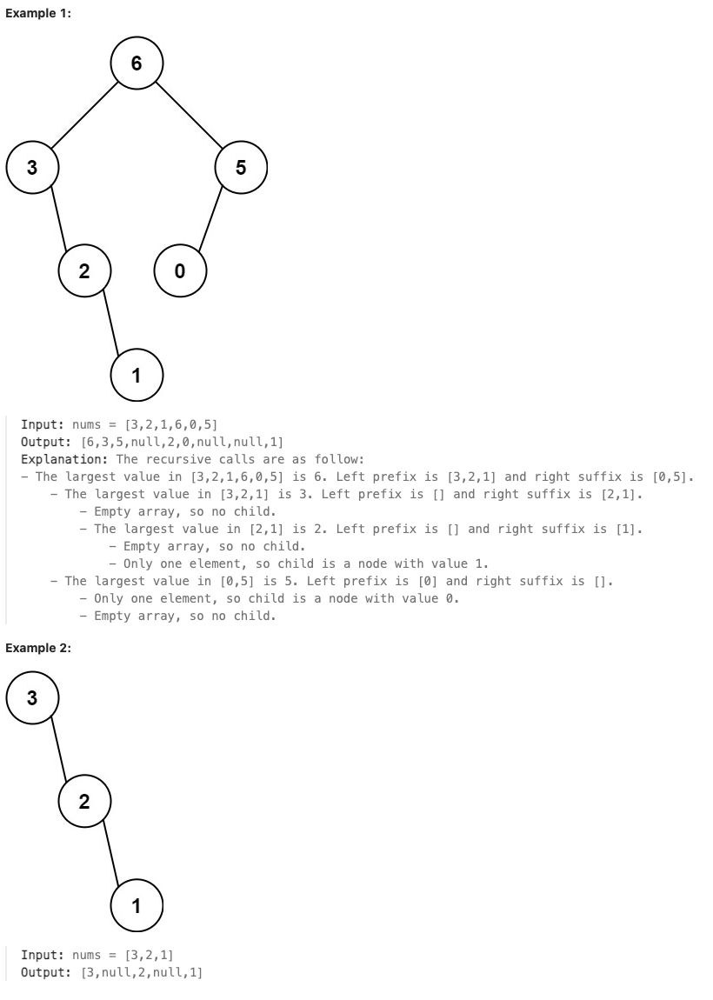

# 654.Maximum Binary Tree

## LeetCode 题目链接

[654.最大二叉树](https://leetcode.cn/problems/maximum-binary-tree/)

## 题目大意

给定一个不重复的整数数组 `nums`，最大二叉树可以用下面的算法从 `nums` 递归地构建:
- 创建一个根节点，其值为 `nums` 中的最大值
- 递归地在最大值`左边`的子数组前缀上构建左子树
- 递归地在最大值`右边`的子数组后缀上构建右子树

返回 `nums` 构建的最大二叉树



限制:
- 1 <= nums.length <= 1000
- 0 <= nums[i] <= 1000
- All integers in nums are unique.

## 解题

构造树一般采用的是前序遍历，因为先构造根节点，然后递归构造左子树和右子树

```js
var constructMaximumBinaryTree = function(nums) {
    return build(nums, 0, nums.length - 1);
};

var build = function(nums, l, h) {
    if (l > h) return null;
    let index = -1, maxVal = -Infinity;
    for (let i = l; i <= h; i++) {
        if (maxVal < nums[i]) {
            index = i;
            maxVal = nums[i];
        }
    }
    
    let root = new TreeNode(maxVal);
    root.left = build(nums, l, index - 1);
    root.right = build(nums, index + 1, h);
    return root;
};
```
```python
# Definition for a binary tree node.
# class TreeNode:
#     def __init__(self, val=0, left=None, right=None):
#         self.val = val
#         self.left = left
#         self.right = right
class Solution:
    def constructMaximumBinaryTree(self, nums: List[int]) -> Optional[TreeNode]:
        return self.build(nums, 0, len(nums) - 1)
        
    def build(self, nums, l, h):
        if l > h:
            return None
        index, maxVal = -1, float('-inf')
        for i in range(l, h+1):
            if maxVal < nums[i]:
                index = i
                maxVal = nums[i]
        
        root = TreeNode(maxVal)
        root.left = self.build(nums, l, index-1)
        root.right = self.build(nums, index+1, h)
        return root
```

- 时间复杂度：最坏情况 `O(n^2)`，平均情况 `O(nlogn)`
- 空间复杂度：最坏情况 `O(n)`，平均情况 `O(logn)`
