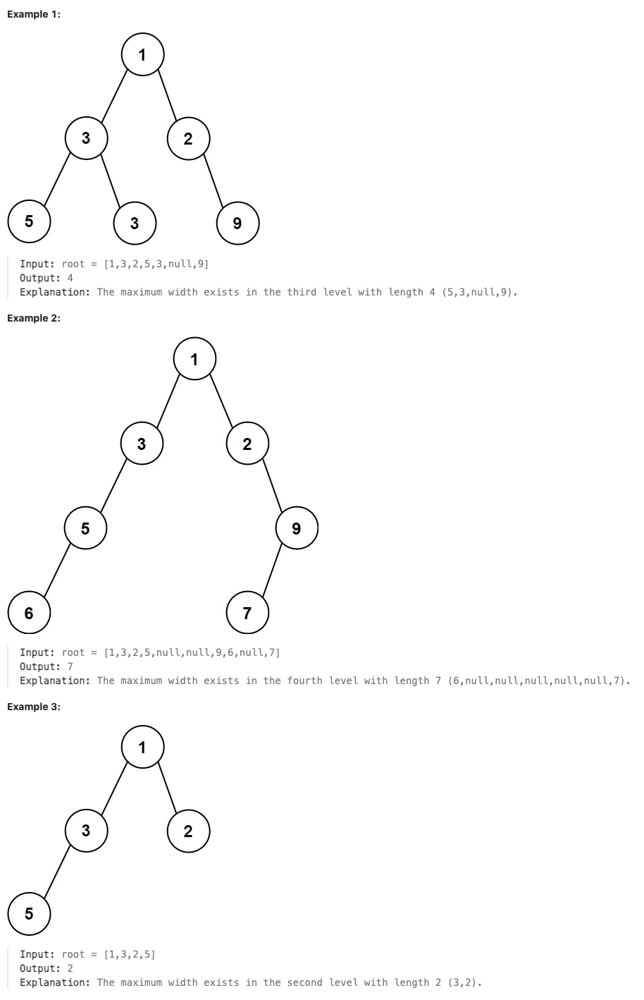

# 662.Maximum Width of Binary Tree

## LeetCode 题目链接

[662.二叉树最大宽度](https://leetcode.cn/problems/maximum-width-of-binary-tree/)

## 题目大意

给你一棵二叉树的根节点 `root`，返回树的最大宽度

树的最大宽度是所有层中最大的宽度

每一层的宽度被定义为该层最左和最右的非空节点（即，两个端点）之间的长度。将这个二叉树视作与满二叉树结构相同，两端点间会出现一些延伸到这一层的 `null` 节点，这些 `null` 节点也计入长度

题目数据保证答案将会在 `32` 位 带符号整数范围内
  


限制:
- The number of nodes in the tree is in the range [1, 3000].
- -100 <= Node.val <= 100

## 解题

### 思路 1: BFS

解题思路：
- 使用 `BFS` 进行层序遍历，并在每一层记录每个节点的索引位置
- 计算每一层的宽度：`width = last_index - first_index + 1`
- 通过比较所有层的宽度，得到树的最大宽度
  
> 注意：为了防止大数溢出和优化宽度计算，通常用相对索引，例如从左向右按 `0、1、2、...` 对每一层的节点编号。对于某节点编号为 `i`，其左子节点编号为 `2 * i`，右子节点编号为 `2 * i + 1`

```js
var widthOfBinaryTree = function(root) {
    if (!root) return 0;
    let maxWidth = 0;
    const que = [[root, 0]];  // 队列保存节点及其索引位置

    while (que.length > 0) {
        const levelLength = que.length;
        const firstIndex = que[0][1];  // 当前层最左节点的索引
        const lastIndex = que[que.length - 1][1];  // 当前层最右节点的索引
        // 计算当前层的宽度并更新最大宽度
        maxWidth = Math.max(maxWidth, lastIndex - firstIndex + 1);

        // 遍历当前层的每个节点
        for (let i = 0; i < levelLength; i++) {
            const [node, index] = que.shift();

            // 左子节点的索引为 2 * index
            if (node.left) {
                que.push([node.left, 2 * index]);
            }

            // 右子节点的索引为 2 * index + 1
            if (node.right) {
                que.push([node.right, 2 * index + 1]);
            }
        }
    }
    return maxWidth;
};
```
```python
class Solution:
    def widthOfBinaryTree(self, root: TreeNode) -> int:
        if not root:
            return 0
        
        max_width = 0
        que = deque([(root, 0)])  # 队列保存节点及其索引位置

        while que:
            level_size = len(que)
            _, first_index = que[0]  # 获取当前层最左节点的索引
            _, last_index = que[-1]  # 获取当前层最右节点的索引
            
            # 计算当前层的宽度并更新最大宽度
            max_width = max(max_width, last_index - first_index + 1)
            
            # 遍历当前层的每个节点
            for _ in range(level_size):
                node, index = que.popleft()
                
                # 左子节点的索引为 2 * index
                if node.left:
                    que.append((node.left, 2 * index))
                
                # 右子节点的索引为 2 * index + 1
                if node.right:
                    que.append((node.right, 2 * index + 1))
        
        return max_width
```

- 时间复杂度：`O(n)`，遍历了树的每个节点一次，其中 `n` 是树的节点数
- 空间复杂度：`O(n)`
  - 使用了一个队列来进行广度优先搜索，最坏情况下队列会存储整棵树的一层节点（最宽的一层）
  - 如果树是满二叉树，某一层最多有 `O(n/2)=O(n)` 个节点，因此空间复杂度为 `O(n)`

### 思路 2: DFS

它使用递归遍历每一层的节点，并记录每层的最左和最右节点的位置，最后根据这些位置计算各层的宽度，从而找到整个二叉树的最大宽度

```js
var widthOfBinaryTree = function(root) {
    if (!root) return 0;
    // 存储每层最左和最右节点的位置
    const widthMap = new Map();
    let maxWidth = 0;
    const dfs = function(node, depth, position) {
        if (!node) return;
        // 如果是该层第一个节点，记录最左位置
        if(!widthMap.has(depth)) widthMap.set(depth, [position]);
        // 更新该层最右位置
        widthMap.get(depth)[1] = position;
        
        // 递归处理左右子树
        dfs(node.left, depth + 1, position * 2);
        dfs(node.right, depth + 1, position * 2 + 1);
    };

    dfs(root, 0, 0);
    // 计算每层的宽度，找出最大值
    for (let [left, right] of widthMap.values()) {
        maxWidth = Math.max(maxWidth, Number(right - left + 1));
    }
    
    return maxWidth;
};
```
```python
class Solution:
    def widthOfBinaryTree(self, root: TreeNode) -> int:
        if not root:
            return 0
            
        # 存储每层最左和最右节点的位置
        # 用来存储每层的最左位置和最右位置（如 [left_position, right_position]）
        width_map = defaultdict(list)
        # max_width：用于存储二叉树的最大宽度。
        max_width = 0

        # node：当前节点
        # depth：当前节点所在的层数
        # position：当前节点的索引位置，用来计算宽度
        def dfs(node, depth, position):
            # 如果 node 为空，说明已经到达叶子节点的子节点，直接返回
            if not node:
                return
                
            # 如果当前层（depth）还没有任何节点被访问过，即 width_map[depth] 为空，则将当前节点的位置 position 作为该层的最左位置
            if len(width_map[depth]) == 0:
                width_map[depth].append(position)
            # 更新该层最右位置    
            width_map[depth] = [width_map[depth][0], position]
            
            # 递归处理左右子树，注意处理位置索引可能溢出的问题
            # 左子节点的位置为 position * 2
            # 右子节点的位置为 position * 2 + 1
            # 这些位置索引的设定确保每层节点位置保持唯一，可以直接用于宽度计算
            dfs(node.left, depth + 1, position * 2)
            dfs(node.right, depth + 1, position * 2 + 1)

        dfs(root, 0, 0)
        # 计算每层的宽度，找出最大值
        # 每层的宽度计算为 right - left + 1
        for left, right in width_map.values():
            max_width = max(max_width, right - left + 1)
            
        return max_width
```

- 时间复杂度：`O(n)`
  - 每个节点仅访问一次，因此时间复杂度为 `O(n)`，`n` 是树的节点数
- 空间复杂度：`O(n)`
  - `width_map` 中存储每一层的最左和最右位置，最坏情况下需要存储所有层的位置索引，因此空间复杂度为 `O(n)`
  - 递归调用栈的深度最坏情况下也为 `O(n)`，如果树退化为链表，这一空间复杂度达到最坏情况