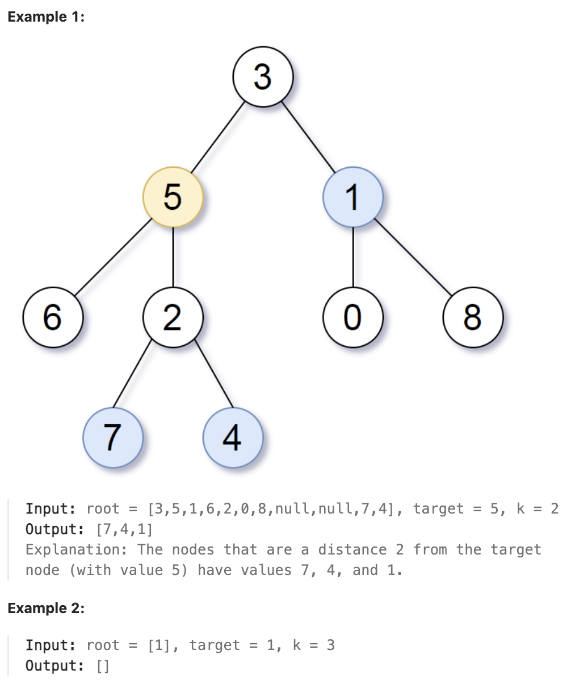

# 863.All Nodes Distance K in Binary Tree

## LeetCode 题目链接

[863.二叉树中所有距离为 K 的结点](https://leetcode.cn/problems/all-nodes-distance-k-in-binary-tree/)

## 题目大意

给定一个二叉树（具有根结点 `root`）， 一个目标结点 `target`，和一个整数值 `k`，返回到目标结点 `target` 距离为 `k` 的所有结点的值的数组

答案可以以 任何顺序 返回



限制:
- The number of nodes in the tree is in the range [1, 500].
- 0 <= Node.val <= 500
- All the values Node.val are unique.
- target is the value of one of the nodes in the tree.
- 0 <= k <= 1000

## 解题

### 思路 1: BFS

这道题常规的解法就是把二叉树变成一幅「图」，然后在图中用 `BFS` 算法求距离 `target` 节点 `k` 步的所有节点

```js
var distanceK = function(root, target, k) {
    // 记录父节点：node.val -> parentNode
    // 题目说了树中所有节点值都是唯一的，所以可以用 node.val 代表 TreeNode
    let parent = new Map();

    // 遍历所有节点，记录每个节点的父节点
    var traverse = function(node, parentNode) {
        if (node === null) return;
        parent.set(node.val, parentNode);
        // 二叉树递归框架
        traverse(node.left, node);
        traverse(node.right, node);
    }; 
    traverse(root, null);

    // 开始从 target 节点施放 BFS 算法，找到距离为 k 的节点
    let que = [], visited = new Set();
    que.push(target);
    visited.add(target.val);
    // 记录离 target 的距离
    let dist = 0, res = [];
    while (que.length) {
        let size = que.length;
        for (let i = 0; i < size; i++) {
            let cur = que.shift();
            // 找到距离起点 target 距离为 k 的节点
            if (dist === k) res.push(cur.val);
            // 向父节点、左右子节点扩散
            let parentNode = parent.get(cur.val);
            if (parentNode !== null && !visited.has(parentNode.val)) {
                visited.add(parentNode.val);
                que.push(parentNode);
            }

            if (cur.left !== null && !visited.has(cur.left.val)) {
                visited.add(cur.left.val);
                que.push(cur.left);
            }

            if (cur.right !== null && !visited.has(cur.right.val)) {
                visited.add(cur.right.val);
                que.push(cur.right);
            }
        }
        // 向外扩展一圈
        dist++;
    }
    return res;
};
```
```python
class Solution:
    def distanceK(self, root: TreeNode, target: TreeNode, k: int) -> List[int]:
        self.parent = {}

        # 遍历所有节点，记录每个节点的父节点
        self.traverse(root, None)

        que = deque()
        que.append(target)
        visited = set()
        visited.add(target.val)
        # 记录离 target 的距离
        dist = 0
        res = []

        while que:
            size = len(que)
            for i in range(size):
                cur = que.popleft()
                # 找到距离起点 target 距离为 k 的节点
                if dist == k:
                    res.append(cur.val)
                
                # 向父节点、左右子节点扩散
                parentNode = self.parent.get(cur.val)
                if parentNode and parentNode.val not in visited:
                    visited.add(parentNode.val)
                    que.append(parentNode)

                if cur.left and cur.left.val not in visited:
                    visited.add(cur.left.val)
                    que.append(cur.left)

                if cur.right and cur.right.val not in visited:
                    visited.add(cur.right.val)
                    que.append(cur.right)
                
            # 向外扩展一圈
            dist += 1
        
        return res
    
    def traverse(self, root, parentNode):
        if root is None:
            return
        
        self.parent[root.val] = parentNode
        # 二叉树递归框架
        self.traverse(root.left, root)
        self.traverse(root.right, root)
```

- 时间复杂度：`O(n)`
  - `traverse` 方法：遍历整个二叉树，访问每个节点一次，时间复杂度 `O(n)`，`n` 是树中的节点数
  - `distanceK` 方法：
    - 首先调用 `traverse`，复杂度 `O(n)`
    - 然后进行 `BFS`：在最坏情况下，可能需要访问所有节点，每个节点最多被加入队列一次，对每个节点的操作（检查父节点和子节点）是常数时间
    - `BFS` 部分的复杂度也是 `O(n)`
- 空间复杂度：`O(n)`，最坏情况下递归栈的深度是树的高度，树的高度在最坏情况下是 `O(n)`，在平均情况下（平衡树）是 `O(log n)`；其他变量也是 `O(n)`

### 思路 2: DFS

```js
var distanceK = function(root, target, k) {
    let res = [];

    // 找到从 target 节点往下距离为 K 的所有节点
    function findDistanceKDown(node, K) {
        if (!node || K < 0) return;
        if (K === 0) {
            res.push(node.val);
            return;
        }
        findDistanceKDown(node.left, K - 1);
        findDistanceKDown(node.right, K - 1);
    }

    // DFS 查找 target 节点并处理祖先方向的节点
    function dfs(node) {
        if (!node) return -1;
        if (node === target) {
            findDistanceKDown(node, k);  // 从 target 往下找距离为 K 的节点
            return 0;
        }
        // 查找左子树中是否有 target 节点
        let left_distance = dfs(node.left);
        if (left_distance !== -1) {
            if (left_distance + 1 === k) {
                res.push(node.val);
            } else {
                findDistanceKDown(node.right, k - left_distance - 2);  // 处理另一侧子树
            }
            return left_distance + 1;
        }

        // 查找右子树中是否有 target 节点
        let right_distance = dfs(node.right);
        if (right_distance !== -1) {
            if (right_distance + 1 === k) {
                res.push(node.val);
            } else {
                findDistanceKDown(node.left, k - right_distance - 2);  // 处理另一侧子树
            }
            return right_distance + 1;
        }

        return -1;
    }
    dfs(root);
    return res;
};
```
```python
class Solution:
    def distanceK(self, root: TreeNode, target: TreeNode, k: int) -> List[int]:
        res = []
        # 找到从 target 节点往下距离为 K 的所有节点
        def findDistanceKDown(node, K):
            if not node or K < 0:
                return
            if K == 0:
                res.append(node.val)
                return
            findDistanceKDown(node.left, K - 1)
            findDistanceKDown(node.right, K - 1)
        
        # DFS 查找 target 节点并处理祖先方向的节点
        def dfs(node):
            if not node:
                return -1
            if node == target:
                findDistanceKDown(node, k)  # 从 target 往下找距离为 K 的节点
                return 0

            # 查找左子树中是否有 target 节点
            left_distance = dfs(node.left)
            if left_distance != -1:
                # 祖先节点距离目标节点的距离为 left_distance + 1
                if left_distance + 1 == k:
                    res.append(node.val)
                else:
                    findDistanceKDown(node.right, k - left_distance - 2)  # 处理另一侧子树
                return left_distance + 1

            # 查找右子树中是否有 target 节点
            right_distance = dfs(node.right)
            if right_distance != -1:
                # 祖先节点距离目标节点的距离为 right_distance + 1
                if right_distance + 1 == k:
                    res.append(node.val)
                else:
                    findDistanceKDown(node.left, k - right_distance - 2)  # 处理另一侧子树
                return right_distance + 1

            return -1
        
        dfs(root)
        return res
```

- 时间复杂度：`O(n)`，`n` 是二叉树中的节点数。需要遍历所有节点来找到目标节点，且在最坏情况下，所有节点可能都需要进行距离计算
- 空间复杂度：`O(n)`，最坏情况下递归栈的深度是树的高度，树的高度在最坏情况下是 `O(n)`，因此空间复杂度为 `O(n)`