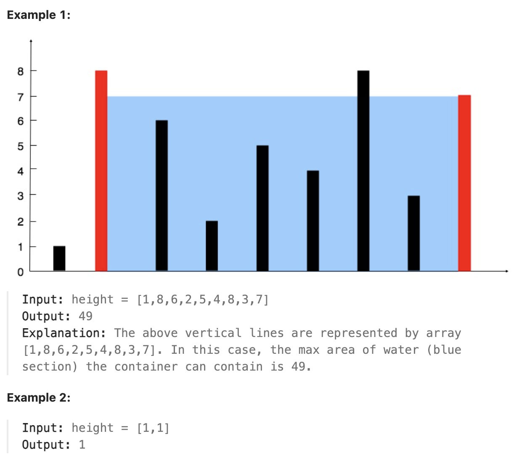

# 11.Container With Most Water

## LeetCode 题目链接

[11.盛最多水的容器](https://leetcode.cn/problems/container-with-most-water/)

## 题目大意

给定一个长度为 `n` 的整数数组 `height`。有 `n` 条垂线，第 `i` 条线的两个端点是 `(i, 0)` 和 `(i, height[i])` 

找出其中的两条线，使得它们与 `x` 轴共同构成的容器可以容纳最多的水

返回容器可以储存的最大水量

说明：不能倾斜容器



限制:
- n == height.length
- 2 <= n <= 10^5
- 0 <= height[i] <= 10^4

## 解题

若确定好左右两端的直线，容纳的水量是由`左右两端直线中较低直线的高度 * 两端直线之间的距离` 所决定的，所以应使得较低直线的高度尽可能的高，这样才能使盛水面积尽可能的大

使用`双指针`求解，移动较低直线所在的指针位置，从而得到不同的高度和面积，最终获取其中最大的面积

这里若移动较低的那一边，那条边可能会变高，使得矩形的高度变大，进而就有可能使得矩形的面积变大；相反，若移动较高的那一边，矩形的高度是无论如何都不会变大的，所以不可能使矩形的面积变得更大

```js
var maxArea = function(height) {
    let res = 0;
    let left = 0, right = height.length - 1;
    while (left < right) {
        let cur_area = Math.min(height[left], height[right]) * (right - left);
        res = Math.max(res, cur_area);
        if (height[left] < height[right]) {
            left++;
        } else {
            right--;
        }
    }
    return res;
};
```
```python
class Solution:
    def maxArea(self, height: List[int]) -> int:
        res = 0
        left, right = 0, len(height) - 1
        while left < right:
            # 如果先移动指针再计算 cur_area，可能会遗漏某些状态下的面积，从而得不到正确的最大值
            # 假设初始状态下左右指针间的面积最大，但在没有先计算面积的情况下，直接移动指针会导致这段状态丢失，无法记录下来
            cur_area = min(height[left], height[right]) * (right - left)
            res = max(res, cur_area)
            if height[left] < height[right]:
                left += 1
            else:
                right -= 1
        
        return res
```

- 时间复杂度：`O(n)`，每个元素最多被访问一次，因此时间复杂度为线性
- 空间复杂度：`O(1)`，只使用了常数级别的辅助变量，没有使用额外的数据结构