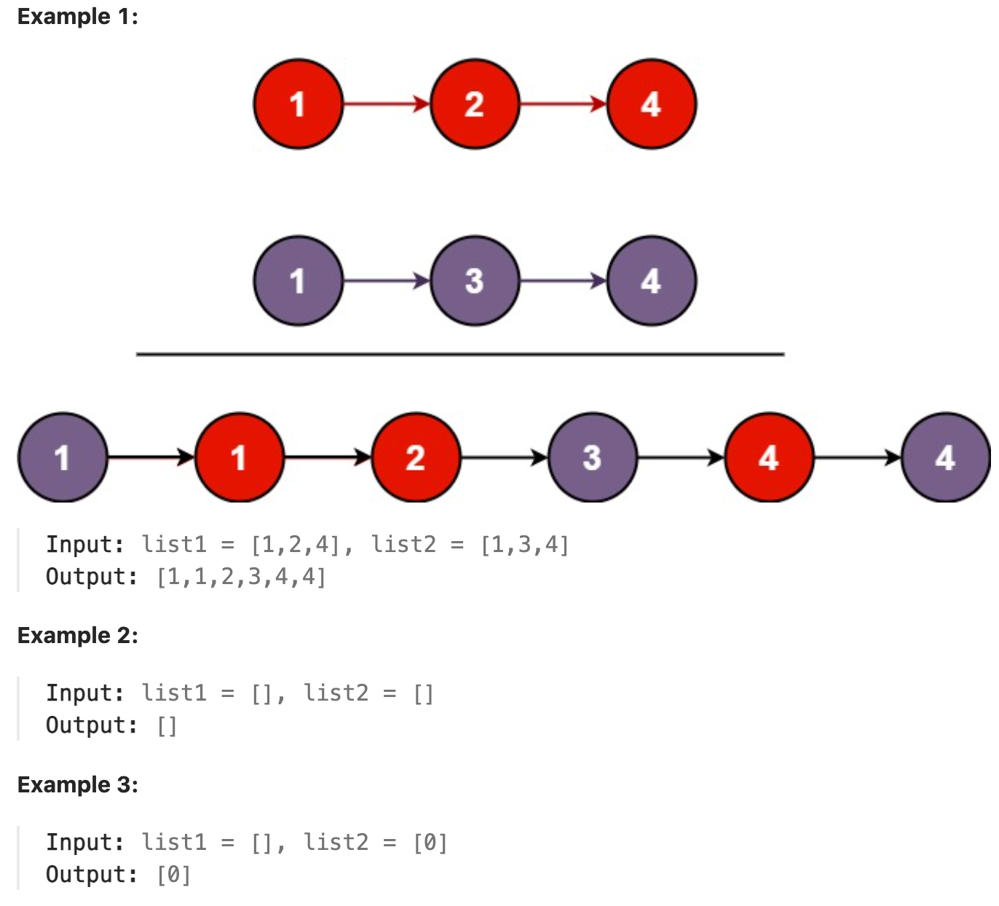

# 21.Merge Two Sorted Lists

## LeetCode 题目链接

[21.合并两个有序链表](https://leetcode.cn/problems/merge-two-sorted-lists/)

## 题目大意

将两个升序链表合并为一个新的`升序`链表并返回

新链表是通过拼接给定的两个链表的所有节点组成的



限制：
- The number of nodes in both lists is in the range [0, 50].
- -100 <= Node.val <= 100
- Both list1 and list2 are sorted in non-decreasing order.

## 解题

```js
var mergeTwoLists = function(list1, list2) {
    let dummy = new ListNode(-1);
    let p = dummy;
    let p1 = list1, p2 = list2;
    while (p1 != null & p2 != null) {
        if (p1.val > p2.val) {
            p.next = p2;
            p2 = p2.next;
        } else {
            p.next = p1;
            p1 = p1.next;
        }
        p = p.next;
    }
    if (p1 != null) p.next = p1;
    if (p2 != null) p.next = p2;
    
    return dummy.next;
};
```
```python
class Solution:
    def mergeTwoLists(self, list1: Optional[ListNode], list2: Optional[ListNode]) -> Optional[ListNode]:
        dummy = ListNode(-1)
        p = dummy
        p1, p2 = list1, list2
        while p1 and p2:
            if p1.val > p2.val:
                p.next = p2
                p2 = p2.next
            else:
                p.next = p1
                p1 = p1.next
            
            p = p.next
        
        if p1:
            p.next = p1

        if p2:
            p.next = p2
        
        return dummy.next
```

- 时间复杂度：`O(n+m)`，`n` 和 `m` 分别为 `list1` 和 `list2` 的长度，代码遍历了两个链表中每个节点一次
- 空间复杂度：`O(1)`，除了指针变量外，没有使用其他额外的内存