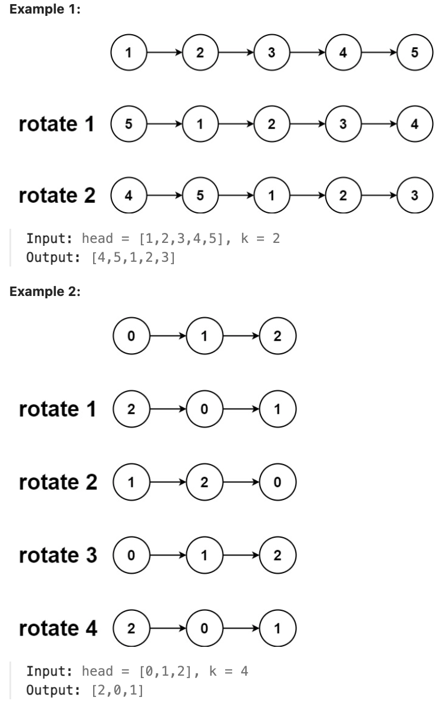

# 61.Rotate List

## LeetCode 题目链接

[61.旋转链表](https://leetcode.cn/problems/rotate-list/)

## 题目大意

给一个链表的头节点 `head`，旋转链表，将链表每个节点向右移动 `k` 个位置



限制:
- The number of nodes in the list is in the range [0, 500].
- -100 <= Node.val <= 100
- 0 <= k <= 2 * 10^9

## 解题

在旋转链表时，目标是将链表右移 `k` 次，这意味着最后的 `k` 个节点会被移到链表的最前面

```js
var rotateRight = function(head, k) {
    if (k == 0 || head == null || head.next == null) return head;
    let cur = head;
    let count = 1;
    while (cur.next != null) {
        cur = cur.next;
        count++;
    }

    // 旋转 k 次与旋转 k % count 次的效果是一样的，例如，如果列表有 5 个节点，并且您将其旋转 6 次，则与旋转 1 次相同
    // 所以可以通过 k % count 计算出实际需要旋转的步数
    // 有效地减少了多余的旋转次数，如当 k 大于链表长度时，可直接简化为一个等效的较小旋转次数
    // 通过计算 cut 来确定新的头节点和尾节点的位置
    // cut 是从列表开头到需要拆分列表进行旋转的点的步数
    // cut = count - k % count，表示在旋转之前应该保留多少个节点（从列表的开头开始），以及在哪里打破列表以执行旋转
    let cut = count - k % count;
    // 形成环的操作能够将链表的旋转转化为一个简单的移动操作
    // 将链表连成环，然后再适当位置断开，这样可以轻松地处理旋转操作，而不需要逐个调整节点的指针
    cur.next = head;
    while (cut > 0) {
        cur = cur.next;
        cut--;
    }
    let newHead = cur.next;
    cur.next = null;
    return newHead;
};
```
```python
# Definition for singly-linked list.
# class ListNode:
#     def __init__(self, val=0, next=None):
#         self.val = val
#         self.next = next
class Solution:
    def rotateRight(self, head: Optional[ListNode], k: int) -> Optional[ListNode]:
        if k == 0 or head == None or head.next == None:
            return head
        
        cur = head
        count = 1
        while cur.next != None:
            cur = cur.next
            count += 1
        
        # 旋转 k 次与旋转 k % count 次的效果是一样的，如，列表有 5 个节点，且将其旋转 6 次，则与旋转 1 次相同
        # 所以可以通过 k % count 计算出实际需要旋转的步数
        # 有效地减少了多余的旋转次数，如当 k 大于链表长度时，可直接简化为一个等效的较小旋转次数
        # 通过计算 cut 来确定新的头节点和尾节点的位置
        # cut 是从列表开头到需要拆分列表进行旋转的点的步数
        # cut = count - k % count ，表示在旋转之前应该保留多少个节点（从列表的开头开始），以及在哪里打破列表以执行旋转
        cut = count - k % count

        # 形成环的操作能够将链表的旋转转化为一个简单的移动操作
        # 将链表连成环，然后再适当位置断开，这样可以轻松地处理旋转操作，而不需要逐个调整节点的指针
        cur.next = head
        while cut > 0:
            # 前进 cut 步，cur 最终指向新的尾节点，即旋转后链表的最后一个节点
            cur = cur.next
            cut -= 1
            
        # 当链表成环后，cur 的位置实际上是旋转后的新尾节点的位置
        # 在链表形成环后，cur 的下一个节点 cur.next 就是新的头节点
        newHead = cur.next
        cur.next = None

        return newHead
```
- 时间复杂度：`O(n)`
- 空间复杂度：`O(1)`