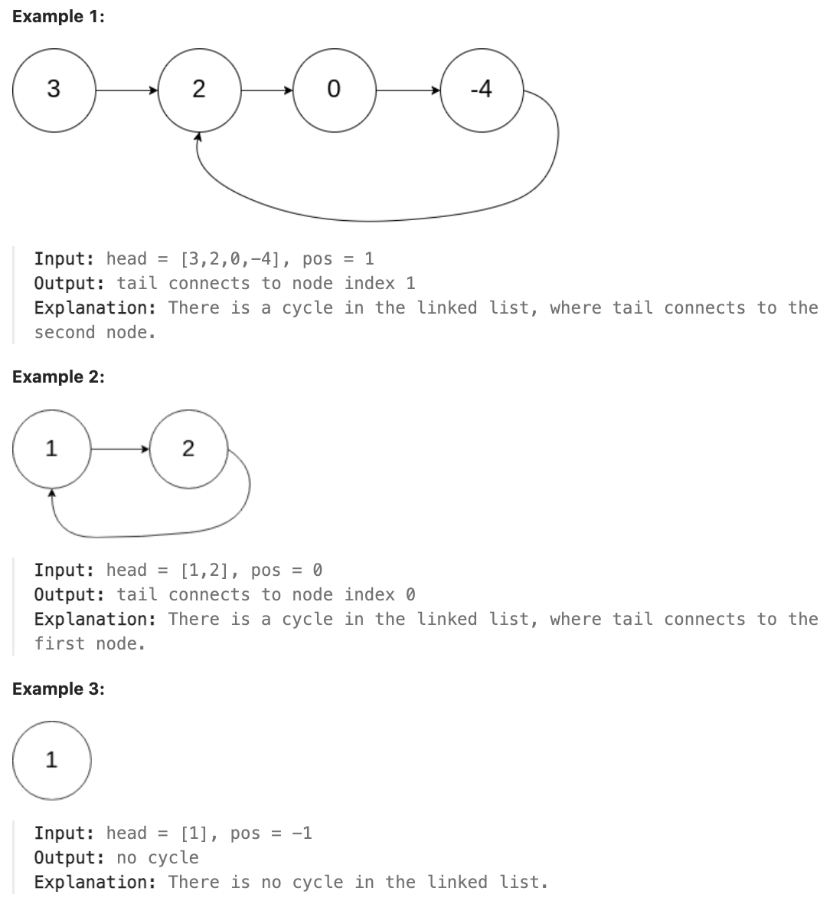
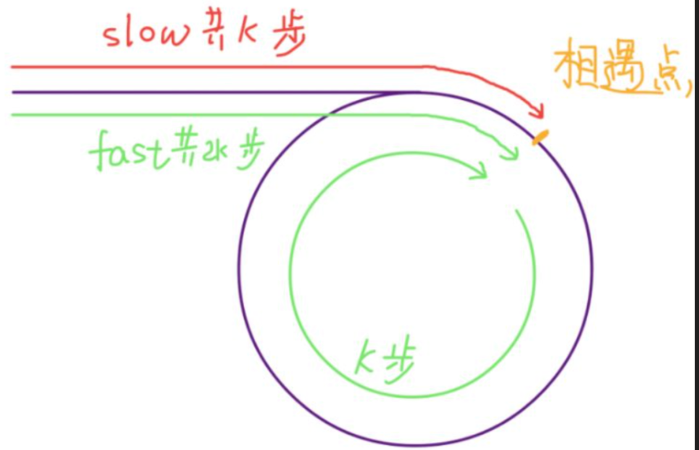
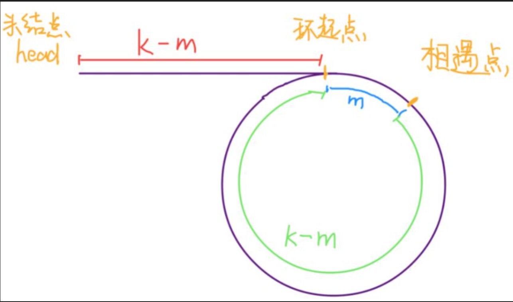

# 142.Linked List Cycle II

## LeetCode 题目链接

[142.环形链表 II](https://leetcode.cn/problems/linked-list-cycle-ii/)

## 题目大意

给定一个链表的头节点 `head`，返回链表开始入环的第一个节点，若链表无环，则返回 `null`

若链表中有某个节点，可通过连续跟踪 `next` 指针再次到达，则链表中存在环

为了表示给定链表中的环，评测系统内部使用整数 `pos` 来表示链表尾连接到链表中的位置（索引从 `0` 开始）；若 `pos` 是 `-1`，则在该链表中没有环

注意：`pos` 不作为参数进行传递，仅仅是为了标识链表的实际情况

`不允许修改`链表



限制:
- The number of the nodes in the list is in the range [0, 10^4].
- -10^5 <= Node.val <= 10^5
- pos is -1 or a valid index in the linked-list.

## 解题

假设快慢指针相遇时，慢指针 `slow` 走了 `k` 步，则快指针 `fast` 一定走了 `2k` 步

`fast` 一定比 `slow` 多走了 `k` 步，多走的 `k` 步其实就是 `fast` 指针在环里转圈圈，所以 `k` 的值就是环长度的`整数倍`



假设相遇点距环的起点的距离为 `m`，则环的起点距头结点 `head` 的距离为 `k - m`，即若从 `head` 前进 `k - m` 步就能到达环起点。若从相遇点继续前进 `k - m` 步，也恰好到达环起点



所以，只要把快慢指针中的任一个重新指向 `head`，然后两个指针同速前进，`k - m` 步后一定会相遇，相遇之处就是环的起点

```js
// 写法 1
var detectCycle = function(head) {
    let slow = head, fast = head;
    while (fast != null && fast.next != null) {
        slow = slow.next;
        fast = fast.next.next;
        if (slow == fast) {
            let index1 = fast, index2 = head;
            while (index1 != index2) {
                index1 = index1.next;
                index2 = index2.next;
            }
            return index1;
        }
    }
    return null;
};

// 写法 2
var detectCycle = function(head) {
    let slow = head, fast = head;
    while (fast != null && fast.next != null) {
        slow = slow.next;
        fast = fast.next.next;
        if (slow == fast) break;
    }
    if (fast == null || fast.next == null) return null;
    slow = head;
    while (slow != fast) {
        slow = slow.next;
        fast = fast.next;
    }
    return slow;
};
```
```python
# 写法 1
class Solution:
    def detectCycle(self, head: Optional[ListNode]) -> Optional[ListNode]:
        slow, fast = head, head
        while fast != None and fast.next != None:
            slow = slow.next
            fast = fast.next.next
            if slow == fast:
                index1, index2 = fast, head
                while index1 != index2:
                    index1 = index1.next
                    index2 = index2.next
                return index1
        
        return None

# 写法 2
class Solution:
    def detectCycle(self, head: Optional[ListNode]) -> Optional[ListNode]:
        slow, fast = head, head

        while fast and fast.next:
            slow = slow.next
            fast = fast.next.next
            if slow == fast:
                break
        
        # 因为循环的条件是fast和fast.next都存在，所以当循环退出时，可能存在两种情况：
        # - 一种是快慢指针相遇了（break 退出循环）
        # - 另一种是 fast 或 fast.next 为空，导致循环条件不满足而退出
        # 因此，在循环后需判断是否是因为相遇而退出循环，还是因为到达链表末尾而退出循环
        if not fast or not fast.next:
            return None
        
        slow = head
        while slow != fast:
            slow = slow.next
            fast = fast.next
        
        return slow
```

- 时间复杂度：`O(n)`
  - 快慢指针相遇前，指针走的次数小于链表长度
  - 快慢指针相遇后，两个指针走的次数也小于链表长度，总体为走的次数小于 `2n`
- 空间复杂度：`O(1)`