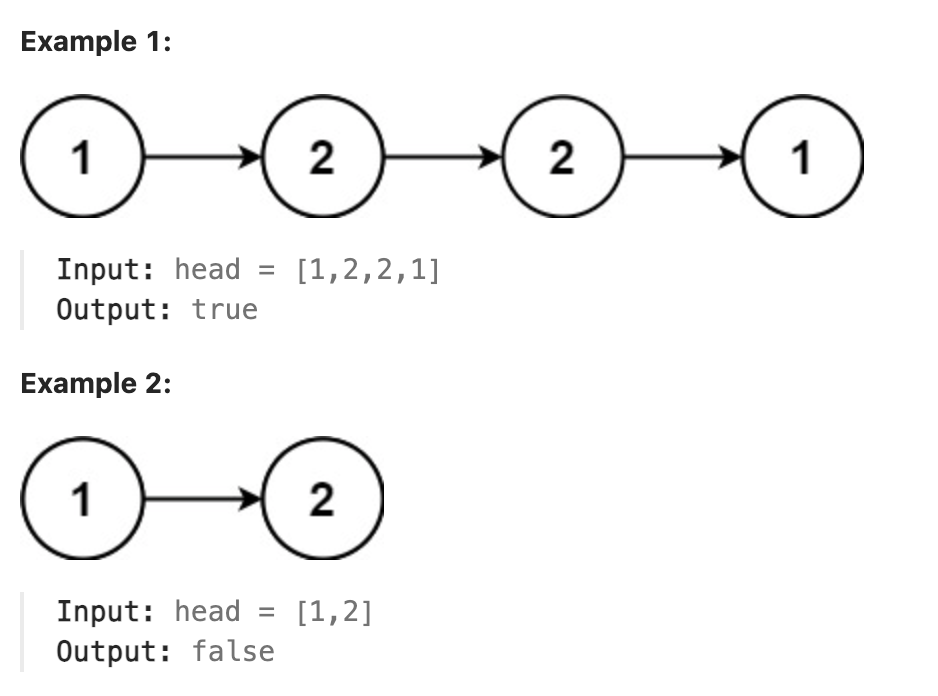

# 234.Palindrome Linked List

## LeetCode 题目链接

[234.回文链表](https://leetcode.cn/problems/palindrome-linked-list/)

## 题目大意

给一个单链表的头节点 `head`，请判断该链表是否为`回文链表`。若是，返回 `true`；否则，返回 `false`



限制:
- The number of nodes in the list is in the range [1, 10^5].
- 0 <= Node.val <= 9

## 解题

### 思路 1

这道题的关键在于，单链表无法倒着遍历，无法使用双指针技巧

最简单的办法就是，把原始链表反转存入一条新的链表，然后比较这两条链表是否相同

但更聪明一些的办法是借助双指针：
- 先通过`双指针方法`中的快慢指针来找到链表的中点
- 如果 `fast` 指针没有指向 `null`，说明链表长度为奇数，`slow` 还要再前进一步
- 从 `slow` 开始反转后面的链表，就可以开始比较回文串

```js
var isPalindrome = function(head) {
    let slow = fast = head;
    while (fast != null && fast.next != null) {
        slow = slow.next;
        fast = fast.next.next;
    }

    if (fast != null) {
        slow = slow.next;
    }

    let left = head, right = reverse(slow);
    while (right != null) {
        if (left.val != right.val) return false;
        left = left.next;
        right = right.next;
    }
    return true;
};

var reverse = function(head) {
    let pre = null, cur = head;
    while (cur != null) {
        let next = cur.next;
        cur.next = pre;
        pre = cur;
        cur = next;
    }
    return pre;
};
```
```python
class Solution:
    def isPalindrome(self, head: Optional[ListNode]) -> bool:
        slow = fast = head
        while fast and fast.next:
            slow = slow.next
            fast = fast.next.next
        # 若 fast 指针没有指向 null，说明链表长度为奇数，slow 还要再前进一步
        if fast:
            slow = slow.next
        
        left = head
        right = self.reverse(slow)
        while right:
            if left.val != right.val:
                return False
            
            left = left.next
            right = right.next
        
        return True

    def reverse(self, head):
        pre,cur = None, head
        while cur:
            temp = cur.next
            cur.next = pre
            pre = cur
            cur = temp
        return pre
```

- 时间复杂度：`O(n)`
- 空间复杂度：`O(1)`

### 思路 2

使用一个数组来保存 `node` 值，然后遍历对比

```js
var isPalindrome = function(head) {
    let nodes = [], p = head;
    while (p != null) {
        nodes.push(p.val);
        p = p.next;
    }

    let n = nodes.length;
    for (let i = 0; i < n / 2; i++) {
        if (nodes[i] != nodes[n-i-1]) return false;
    }
    return true;
};
```
```python
class Solution:
    def isPalindrome(self, head: Optional[ListNode]) -> bool:
        nodes, p = [], head
        while p:
            nodes.append(p.val)
            p = p.next
        
        n = len(nodes)
        # 比较 nodes 中的前半部分与后半部分是否相等
        for i in range(n//2):
            if nodes[i] != nodes[n-i-1]:
                return False
        
        return True
```

- 时间复杂度：`O(n)`
- 空间复杂度：`O(n)`