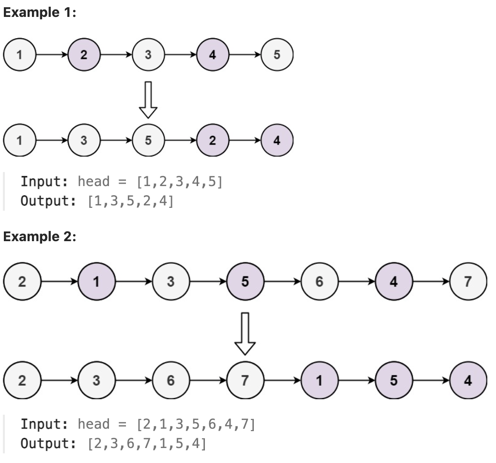

# 328.Odd Even Linked List

## LeetCode 题目链接

[328.奇偶链表](https://leetcode.cn/problems/odd-even-linked-list/)

## 题目大意

给定单链表的头节点 `head`，将所有索引为奇数的节点和索引为偶数的节点分别组合在一起，然后返回重新排序的列表

第一个节点的索引被认为是奇数， 第二个节点的索引为偶数，以此类推

请注意，偶数组和奇数组内部的相对顺序应该与输入时保持一致

必须在 `O(1)` 的额外空间复杂度和 `O(n)` 的时间复杂度下解决这个问题



限制：
- The number of nodes in the linked list is in the range [0, 10^4].
- -10^6 <= Node.val <= 10^6

## 解题

### 写法 1

- 使用两个指针：奇数和偶数。奇数指针将指向第一个节点，偶数指针将指向第二个节点。保持对偶数列表头部 (`evenHead`) 的引用，因为最终，在遍历列表后将把最后一个奇数节点连接到第一个偶数节点
- 遍历：通过交替使用奇数和偶数指针来遍历列表。将奇数移动到下一个奇数节点 (`odd.next = even.next`)，将偶数移动到下一个偶数节点 (`even.next = odd.next`)
- 重新连接：处理完所有节点后，将最后一个奇数节点链接到偶数节点的头部 (`odd.next = evenHead`)
- 边缘情况：若列表少于 `3` 个节点，可直接返回头部

```js
var oddEvenList = function(head) {
    if (!head || !head.next) return head;
    let odd = head, even = head.next;
    let evenHead = even;
    while (even !== null && even.next !== null) {
        odd.next = even.next;
        odd = odd.next;
        even.next = odd.next;
        even = even.next;
    }
    odd.next = evenHead;
    return head;
};
```
```python
class Solution:
    def oddEvenList(self, head: Optional[ListNode]) -> Optional[ListNode]:
        if not head or not head.next:
            return head
        
        odd = head
        even = head.next
        # 将奇数列表与偶数列表重新连接
        evenHead = even

        # 确保在偶数列表中用完节点或没有下一个奇数节点要处理时停止
        while even and even.next:
            odd.next = even.next
            # 将奇数指针向前移动到下一个奇数节点
            odd = odd.next
            even.next = odd.next
            # 将偶数指针向前移动到下一个偶数节点
            even = even.next
        
        # 将节点重新排列成两个单独的列表（奇数和偶数）后，奇数列表中的最后一个节点应链接到偶数列表的头部
        # 奇数列表中的最后一个节点应指向偶数列表中的第一个节点（存储在 evenHead 中），从而将两个列表合并
        odd.next = evenHead
        return head
```

- 时间复杂度：`O(n)`，`n` 是节点数量，只遍历链表 `1` 次
- 空间复杂度：`O(1)`

### 写法 2

```python
class Solution:
    def oddEvenList(self, head: Optional[ListNode]) -> Optional[ListNode]:
        if not head or not head.next or not head.next.next:
            return head

        evenHead = head.next
        odd, even = head, evenHead
        isOdd = True
        cur = head.next.next
        while cur:
            if isOdd:
                odd.next = cur
                odd = cur
            else:
                even.next = cur
                even = cur
            
            isOdd = not isOdd
            cur = cur.next
        
        odd.next = evenHead
        even.next = None

        return head
```

- 时间复杂度：`O(n)`，`n` 是节点数量
- 空间复杂度：`O(1)`

