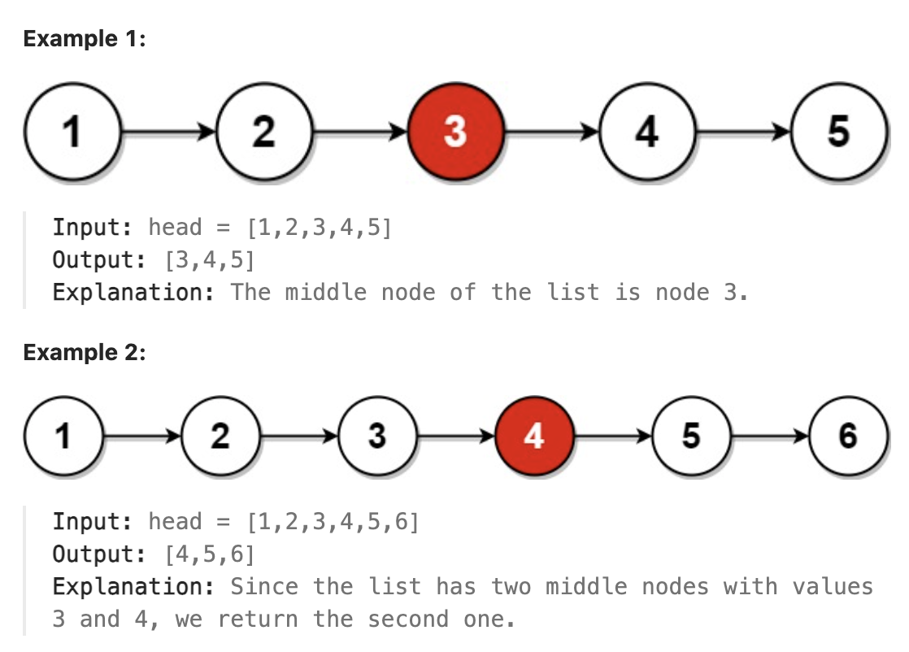

# 876.Middle of the Linked List

## LeetCode 题目链接

[876.链表的中间结点](https://leetcode.cn/problems/middle-of-the-linked-list/)

## 题目大意

给单链表的头结点 `head`，请找出并返回链表的中间结点，若有两个中间结点，则返回第二个中间结点



限制:
- The number of nodes in the list is in the range [1, 100].
- 1 <= Node.val <= 100

## 解题

若想一次遍历就得到中间节点，使用`快慢指针`的技巧
- 让两个指针 `slow` 和 `fast` 分别指向链表头结点 `head`
- 当慢指针 `slow` 前进一步，快指针 `fast` 就前进两步；当 `fast` 走到链表末尾时 `slow` 就指向了链表中点

```js
var middleNode = function(head) {
    let slow = fast = head;
    while (fast != null && fast.next != null) {
        slow = slow.next;
        fast = fast.next.next;
    }
    return slow;
};
```
```python
class Solution:
    def middleNode(self, head: Optional[ListNode]) -> Optional[ListNode]:
        slow = fast = head
        while fast and fast.next:
            slow = slow.next
            fast = fast.next.next
        
        return slow
```

- 时间复杂度：`O(n)`
- 空间复杂度：`O(1)`