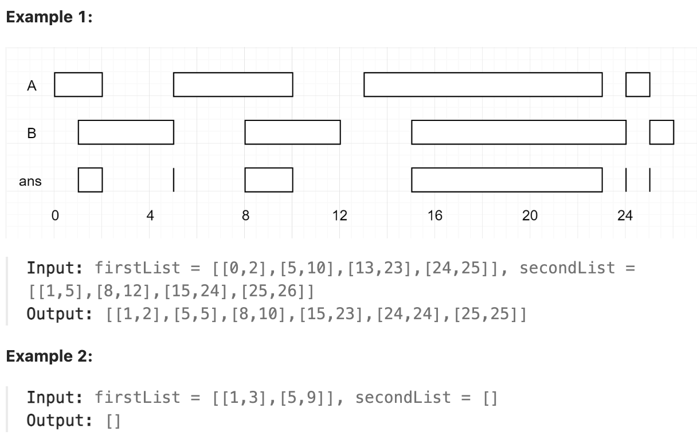

# 986.Interval List Intersections

## LeetCode 题目链接

[986.区间列表的交集](https://leetcode.cn/problems/interval-list-intersections/)

## 题目大意

给定两个由一些 闭区间 组成的列表，`firstList` 和 `secondList`，其中 `firstList[i] = [starti, endi]` 而 `secondList[j] = [startj, endj]`。每个区间列表都是成对`不相交`的，并且已经排序

返回这两个区间列表的交集 

形式上，闭区间 `[a, b]（其中 a <= b）`表示实数 `x` 的集合，而 `a <= x <= b`

两个闭区间的`交集`是一组实数，要么为空集，要么为闭区间。例如，`[1, 3]` 和 `[2, 4]` 的交集为 `[2, 3]` 



限制:
- 0 <= firstList.length, secondList.length <= 1000
- firstList.length + secondList.length >= 1
- 0 <= start_i < end_i <= 10^9
- end_i < start_i + 1
- 0 <= startj < endj <= 10^9 
- end_j < start_j + 1
  
## 解题

可以使用`双指针归并法`的方法来解决这个问题。由于两个区间列表都是有序的，逐步检查两个列表中的区间并找出它们的交集

具体步骤：
- 使用两个指针 `i` 和 `j`，分别遍历 `firstList` 和 `secondList`
- 对于每对区间 `firstList[i]` 和 `secondList[j]`，计算它们的交集：
  - 交集的起点是 `max(firstList[i][0], secondList[j][0])`
  - 交集的终点是 `min(firstList[i][1], secondList[j][1])`
  - 若交集有效（起点 <= 终点），就将这个交集加入结果
- 然后移动指针，较小的区间结束时，移动对应的指针到下一个区间
- 重复以上步骤，直到其中一个列表遍历完

```js
var intervalIntersection = function(firstList, secondList) {
    let i = 0, j = 0;
    const res = [];

    while (i < firstList.length && j < secondList.length) {
        // 计算交集的起点和终点
        let start = Math.max(firstList[i][0], secondList[j][0]);
        let end = Math.min(firstList[i][1], secondList[j][1]);

        // 如果交集有效，加入结果
        if (start <= end) res.push([start, end]);

        // 移动指针：比较区间结束时间，结束时间小的区间指针向前移动
        if (firstList[i][1] < secondList[j][1]) {
            i++;
        } else {
            j++;
        }
    }

    return res;
};
```
```python
class Solution:
    def intervalIntersection(self, firstList: List[List[int]], secondList: List[List[int]]) -> List[List[int]]:
        i, j = 0, 0
        res = []

        while i < len(firstList) and j < len(secondList):
            # 计算交集的起点和终点
            start = max(firstList[i][0], secondList[j][0])
            end = min(firstList[i][1], secondList[j][1])

            # 如果交集有效，加入结果
            if start <= end:
                res.append([start, end])
            
            # 移动指针：较小的区间结束时移动对应的指针
            if firstList[i][1] < secondList[j][1]:
                i += 1
            else:
                j += 1
        
        return res
```

- 时间复杂度：`O(n + m)`，`n` 和`m` 分别是两个输入列表的长度
  - 需遍历两个列表一次
  - 在每次迭代中，进行常数时间的操作
- 空间复杂度：`O(min(m, n))`
  - 交集的数量限制：
    - 交集的数量不可能超过较短列表的长度
    - 因为较短列表中的每个区间最多只能贡献一个交集
    - 即使较长列表有更多区间，也无法产生更多的交集除了输出数组外，只使用了几个变量