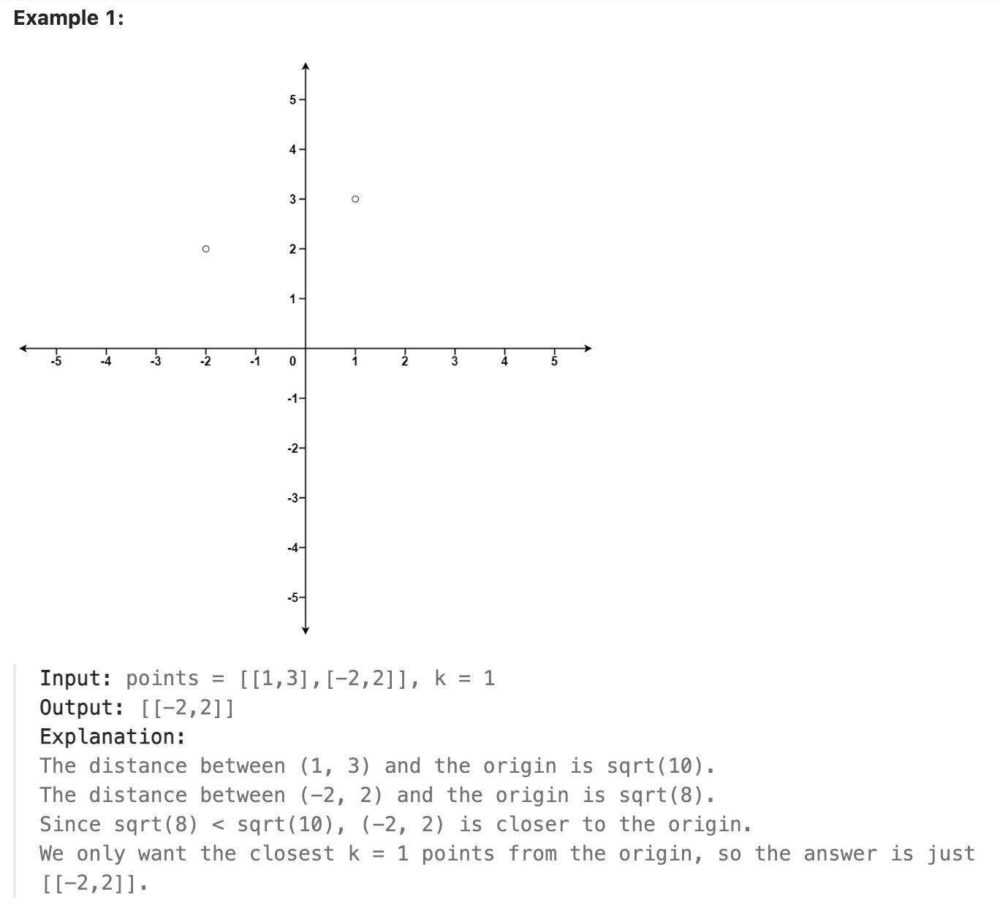

# 973.K Closest Points to Origin

## LeetCode 题目链接

[973.最接近原点的 K 个点](https://leetcode.cn/problems/k-closest-points-to-origin/)

## 题目大意

给定一个数组 `points`，其中 `points[i] = [x_i, y_i]` 表示 `X-Y` 平面上的一个点，且是一个整数 `k`，返回离原点 `(0,0)` 最近的 `k` 个点

这里，平面上两点之间的距离是欧几里德距离（`√(x_1 - x_2)^2 + (y_1 - y_2)^2`）

可以按任何顺序返回答案，除了点坐标的顺序之外，答案`确保`是唯一的



限制:
- 1 <= k <= points.length <= 10^4
- -10^4 <= xi, yi <= 10^4

## 解题

### 思路 1: 优先级队列

```js
var kClosest = function(points, k) {
    // 创建一个最小优先级队列（默认最小堆）
    const minHeap = new MinPriorityQueue({
        priority: (point) => point[0]  // 使用点的距离作为优先级
    });

    // 遍历所有点，并将其加入最小优先级队列
    for (const [x, y] of points) {
        const dist = x * x + y * y;
        minHeap.enqueue([dist, [x, y]]);
    }

    // 提取堆中前 k 个最小距离的点
    const res = [];
    for (let i = 0; i < k; i++) {
        const closestPoint = minHeap.dequeue().element;
        res.push(closestPoint[1]);
    }

    return res;
};
```
```python
class Solution:
    def kClosest(self, points: List[List[int]], k: int) -> List[List[int]]:
        # 使用最大堆存储距离最小的 k 个点
        # Python 默认提供的是最小堆，因此使用负值来模拟最大堆
        max_heap = []

        for x, y in points:
            # 计算距离的平方，不需要开方
            dist = -(x * x + y * y)
            # 将当前点的距离加入堆中，并将坐标存储
            if len(max_heap) < k:
                heapq.heappush(max_heap, (dist, [x, y]))
            else:
                # 当堆的大小达到 k 时，检查当前点是否比堆中的最大距离更小
                if dist > max_heap[0][0]:
                    # 如果当前点的距离比堆中最大距离小，则替换堆顶元素
                    heapq.heapreplace(max_heap, (dist, [x, y]))
        
        # 从堆中取出所有点
        return [point for (dist, point) in max_heap]
```

- 时间复杂度：`O(n log k)`，需遍历 `n` 个点，每次操作堆的时间复杂度是 `O(log k)`
  - 堆的操作时间复杂度：插入、删除、替换堆中元素的操作时间复杂度均为 `O(log k)`
  - 遍历所有点的时间复杂度：`O(n)`，`n` 是 `points` 列表中点的数量
- 空间复杂度：`O(k)`
  - 最大堆 `max_heap` 中存储了最多 `k` 个点，因此空间复杂度为 `O(k)`
  - 最终返回的结果列表的空间复杂度也是 `O(k)`

### 思路 2: 快速选择

```js
var kClosest = function(points, k) {
    // 计算点到原点的距离平方
    const distance = ([x, y]) => x * x + y * y;

    // 快速选择的划分函数
    const partition = (left, right) => {
        const pivotDist = distance(points[right]);
        let storeIndex = left;
        // 将所有小于 pivot 的点移到左侧
        for (let i = left; i < right; i++) {
            if (distance(points[i]) < pivotDist) {
                [points[storeIndex], points[i]] = [points[i], points[storeIndex]];
                storeIndex++;
            }
        }

        // 将基准元素放回 storeIndex 的位置
        [points[right], points[storeIndex]] = [points[storeIndex], points[right]];
        return storeIndex;
    };

    // 快速选择函数：寻找第 k 小的元素
    const quickSelect = (left, right, kSmallest) => {
        if (left === right) return;

        // 执行 partition，得到 pivot 的最终位置
        const pivotPosition = partition(left, right);

        // 根据 pivot 的位置和 k 的关系递归选择
        if (kSmallest === pivotPosition) return;
        else if (kSmallest < pivotPosition) {
            quickSelect(left, pivotPosition - 1, kSmallest);
        } else {
            quickSelect(pivotPosition + 1, right, kSmallest);
        }
    };

    // 执行快速选择，寻找前 k 小的元素
    quickSelect(0, points.length - 1, k);

    // 返回前 k 个点
    return points.slice(0, k);
};
```
```python
class Solution:
    def kClosest(self, points: List[List[int]], k: int) -> List[List[int]]:
    
        # 快速选择函数：寻找第 k 小的元素
        def quickselect(left: int, right: int, k_smallest: int) -> None:
            if left >= right:
                return
            
            # 执行 partition，得到 pivot 的最终位置
            pivot_index = partition(left, right)

            # 根据 pivot 的位置和 k 的关系递归选择
            if k_smallest == pivot_index:
                return
            elif k_smallest < pivot_index:
                quickselect(left, pivot_index - 1, k_smallest)
            else:
                quickselect(pivot_index + 1, right, k_smallest)

        # 计算两点距离
        def distance(point: List[int]) -> float:
            return point[0]**2 + point[1]**2
            
            
        # 快速选择的划分函数
        def partition(left: int, right: int) -> int:
            # 使用 points[right] 可以直接进行分区操作，且不需要在数组内做额外的交换
            pivot = distance(points[right])
            # 用于追踪左侧部分的边界
            i = left
            # 将所有小于 pivot 的点移到左侧
            # 使用 j 指针从 left 到 right-1 遍历数组中的每个元素（除了最后一个基准元素）
            for j in range(left, right):
                if distance(points[j]) <= pivot:
                    # 将当前 points[j] 放到左侧部分的位置（即 i 的位置）
                    # 可以确保 i 位置之前的所有元素都小于或等于 pivot
                    points[i], points[j] = points[j], points[i]
                    # 这样可以确保 i 指针指向左侧部分的最右侧（最后一个满足条件的元素之后的第一个位置）
                    i += 1

            # 将基准元素 points[right] 放回 i 的位置
            # 在这个位置 i 处，左侧所有元素（left 到 i-1）都小于或等于 pivot，右侧所有元素（i+1 到 right）都大于 pivot
            points[i], points[right] = points[right], points[i]
            return i
        
        quickselect(0, len(points) - 1, k)
        return points[:k]
```

- 时间复杂度：平均时间复杂度为 `O(n)`，最坏时间复杂度：`O(n^2)`
  - 平均时间复杂度：`O(n)`，`n` 是数组 `points` 的大小
  - 快速选择在每次划分时，将数组划分为两部分，并只递归处理其中一部分
  - 最坏情况下（如每次划分时选择了极端的 `pivot`），可能导致递归深度为 `n`，每次划分需要 `O(n)` 时间，因此最坏情况的时间复杂度为 `O(n^2)`
- 空间复杂度：`O(1)`（不考虑递归栈），快速选择算法本身不需要额外的辅助数据结构（除了少量的变量和原地交换）
  - 但由于递归的深度（最坏情况为 `O(n)`），所以如果考虑递归栈的空间复杂度，则为 `O(log n)` 到 `O(n)`

### 比较

时间效率：
- 对于小规模数据或 `k` 接近 `n` 的情况，两种方法的性能差异不大
- 对于大规模数据且 `k` 远小于 `n` 的情况，快速选择通常更快，但快速选择的最坏情况（`O(n^2)`）比堆方法更差


空间效率：
- 快速选择方法更优，因为它是原地操作

稳定性：
- 堆方法更稳定，性能波动较小，快速选择的性能可能因输入数据的分布而有较大波动
  
实现复杂度：堆方法的实现更简单直观

输出顺序：
- 堆方法可随时输出当前的 `k` 个最近点
- 快速选择需完成整个过程才能得到结果

适用场景：
- 如果需处理流数据或随时获取当前的 `k` 个最近点，堆方法更合适
- 如果是一次性处理大量数据，快速选择可能更高效